组会分享

Translation-based recommendation

#### 0

之前序列推荐专注于对用户偏好和项目序列分开建模（MC，FPMC），这其实是不利的——因为三者是相关的。TransRec，对用户，项目序列，和预测项目进行三维建模，从而进行序列推荐，

具体来说，项目作为点嵌入到（潜在的）过度空间 “transiton space”中；每个用户都被表示为同一空间中的“平移向量translation vector”。然后，通过个性化平移操作捕获前面提到的三阶交互：前一项 i 的坐标加上 u 的平移向量（近似）确定下一项 j 的坐标，即 γ®i + t® u ≈ γ®j 。

最后，我们对 (u, i, j) 三元组与距离函数 d(γ®i + t®u , γ®j ) 的兼容性进行建模。

在预测时，可以通过以 γ®i + t®u 为中心的最近邻搜索来进行推荐。

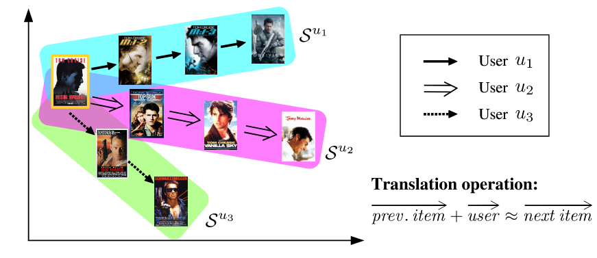

#### model

##### signal

系统中用户集合 (U)， 交互的项目集合 (I)。

对于每个用户 u ∈ U，我们有一个与 u 交互过的项目序列 Su = (Su 1 , Su 2 , ··· , Su |Su |) 。给定所有用户的序列集 S = {Su1 , Su2 , ··· , Su|U| },序列推荐旨在预测每个用户要消费的下一个项目并相应生成推荐列表。

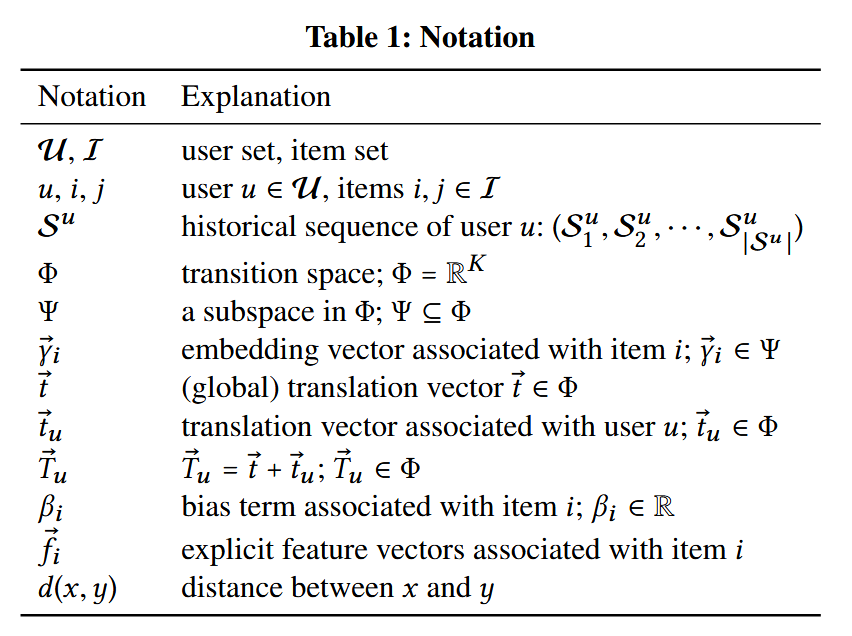

一些符号定义如上。

模型旨在学习 yi 及 tu ，使得


式子使用约等于号，即在某种空间距离度量下，yj 是 左项的最近邻即可，而不用严格相等。

一种常见的解决方法是用内积衡量向量的相似性，但是如果用户倾向于从项目 A 过渡到两个项目 B 和 C，内积无法保证b，c也是相近的。因为内积不能保证 三角不等式（？没太明白其实。内积确实会有这个问题，但是三角不等式怎么能确保呢？）

t 是全局的转换向量，其使得


如此，tu 可以被视为与用户 u 相关联的偏移向量

```
由于生产环境中数据的稀疏性，很难为每个用户学习到一个向量，因此添加了一个全局翻译向量来初始化所有的用户，这样也能够有效的缓解用户冷启动。
```

最后，顺序推荐的概率如下

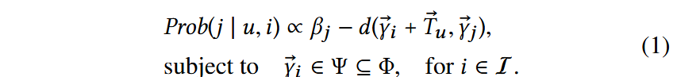

```
项目向量都属于一个大空间的一个子空间，如单位球，这种技术已被证明有助于缓解“维数灾难”问题
```

使用单个偏差项 βj 以捕获总体项目受欢迎程度，热度越高，偏置越小。

##### train

模型训练的最终目标是将真实项目 j 的排名高于所有其他项目 (j′ ∈ I \ j)。这里采用了顺序贝叶斯个性化排名（S-BPR) ，我们在给定 u ，i 的情况下优化排序。（> ui定义为此种情况下的排序大于号）

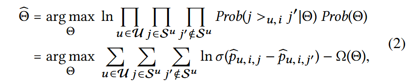其中 i 是 Su 中 j 的前一项，p_u,i, j 是 eq（1）中预测的简写。 θ 是参数的集合——{βi ∈I, γ_i ∈I, t_u ∈U, t}，Ω(θ) 是L2 正则化器。请注意，根据 S-BPR，真实项 j 的排名高于“负”项 j′（即 Prob(j >u,i j′|θ)）的概率由 sigmoid 函数 σ 估计(p_u,i,j − p_u,i,j′)。

项目嵌入 γ_i ∈I 和 t 被随机初始化为单位向量。 βi ∈I 和 t_u ∈U 被初始化为零。首先，我们从 U 中均匀采样用户 u。然后，从 Su 中均匀采样“正”项 j 和“负”项 j′ ，j 是Su中的非头项目，j‘ 是 I 中的非 Su 项目。

对于 eq2 ，我们使用 SGA 随机梯度上升进行训练

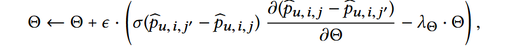

最后，我们将 γ_i 、 γ_j 和 γ_j′ 重新归一化为 Ψ 中的向量。

```
例如，如果我们让 Ψ 为单位 L2-ball，则 γ ← γ/max(1, ∥γ∥)。  重复上述步骤直到收敛或直到验证集上的准确率达到稳定水平。这就是上文所说的“单位球”
```

##### test

对于结果  βj ，将 βj 替换为 βj′ = βj − maxk ∈I βk（对于 j ∈ I）。（移动偏差项不会改变任何查询的项目排名。）

接下来，将 βj′ 吸收到 γ_j 中，对于 L2 距离（平方）得到 γ_j′ = (γ_j ; sqrt(−βj′) )，或者对于 L1 距离 γ_j′ = (γ__j ; β_j′)距离。

最后，给定用户 u 和项目 i，获得“查询”坐标 (γ_i + T_u ; 0)，然后可将其用于检索 γ_j′ 空间中的最近邻居。

#### experiment

暂略

#### Item-to-item recommendation

在TransRec中，通过删除个性化向量部分，TransRec可以直接进行物品到物品的推荐。同样也进行了实验，不再赘述。


————————————————————

SESSION-BASED RECOMMENDATIONS WITH  RECURRENT NEURAL NETWORKS

#### 0

首篇RNN + RS，即GRU4Rec。

具体来说，将用户进入网站时点击的第一个项目视为 RNN 的初始输入，然后希望根据该初始输入查询模型以获取推荐。用户的每次连续点击都会产生一个输出（推荐），该输出取决于之前的所有点击。

与传统 nlp 任务相比，序列推荐有两个主要区别。一是序列稀疏，二是loss的设计。

#### -1

传统会话推荐方法是基于项目相似度的，即根据已有会话信息计算项目到项目的相似性矩阵——会话中经常一起单击的项目被认为是相似的。使用该相似性矩阵来即可推荐与用户当前点击的项目最相似的项目。但这些方法仅考虑用户的最后一次点击，实际上忽略了过去点击的信息。

以及基于一阶马尔可夫链的方法，其中下一个推荐可以根据项目之间的转移概率简单地计算。然而当尝试包含所有可能的用户选择序列时，状态空间很快就会变得难以管理。

基于GFF的方法通过事件的总和来对会话进行建模。但是，此方法不考虑会话内的任何顺序。

#### model

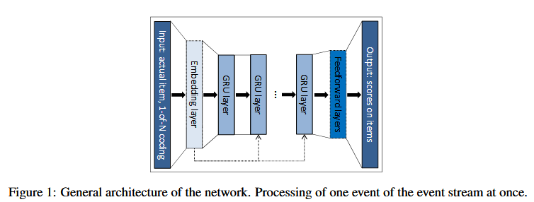

网络的输入

是会话的实际状态，而输出是会话中下一个事件的项目。会话的状态可以是实际事件的项目，也可以是会话中迄今为止的事件。前者项目用独热编码代替，后者使用独热编码的加权和——越早的项目权重越低。

```
我们还尝试添加额外的嵌入层，但 1-of-N 编码总是表现更好。
```

输出

是项目的预测偏好，即每个项目成为会话中下一个项目的可能性。

batch

不同会话的项目数量会差别很大，并且要捕捉完整会话的信息，不能将其分割。因此传统 nlp 任务中的batch方法需要做出调整。

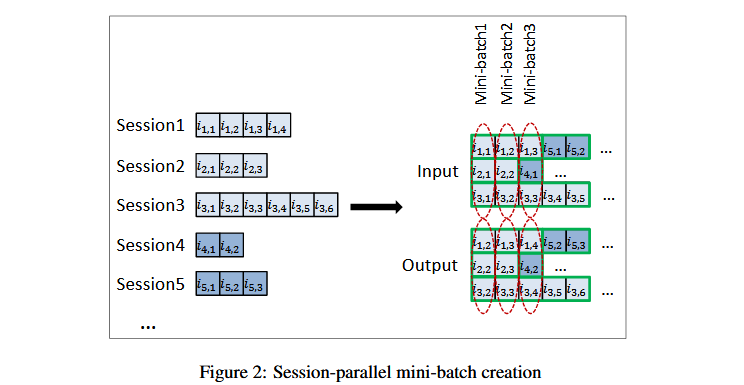

采样

正采样，常规推荐分数的计算需要对每个步骤和项目对进行建模，这是不可行的，所以只挑选部分的项目，也只更改部分项目的参数。

负采样，如果一个项目受欢迎，那用户没有与之产生交互的原因是没有看见的概率很小。因此不为每个训练示例生成单独的样本，而是使用小批量其他训练示例中的项目作为负示例。这样可以节约很多采样时间，同时，这种方法也是基于流行度的采样，因为一个项目出现在小批量的其他训练示例中的可能性与其流行度成正比。

loss

可以看作是分类问题，但是排名问题更优。排名问题有主逐点排名，成对排名，列表排名。本文中使用第二个。

一是BPR，贝叶斯个性化排名，比较正项和抽样负项的分数并使用它们的平均值作为损失。rˆs，k 是会话给定点上项目 k 的分数，i 是所需项目（会话中的下一项），j 是负样本。

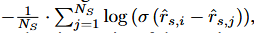

二是 top1 排名，我们希望强制负例的分数在 0 左右，因此添加了一个正则化项目。

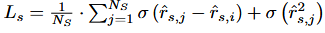

#### 实验

略


——————————————————————————————————————

Personalized top-N sequential recommendation via convolutional sequence embedding.

#### 0

caser,CNN+序列推荐，即利用滤波器捕捉item嵌入矩阵的特征。这篇文章很喜欢举例子，令人感动。

```
绪论中有一个形象的比喻，uer 的general behavier 可以是更喜欢苹果产品相比于三星产品，与之相对的 sequential patterns代表了用户短期和动态的行为，比如说他刚买了iphone。基于general behavier 的推荐不会推荐user手机配件，但是关注时序后可以推荐手机配件。
```

序列推荐旨在给定Su （item序列），考虑sequential patterns和 general perferences，为每个user推荐一个item list来最大化满足他的需求，

现有的模型并未考虑顺序模式中的跳跃行为，如c

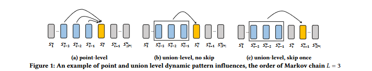

```
例如，一个游客依次在机场、酒店、餐厅、酒吧和景点进行签到。虽然机场和酒店的签到并不紧邻景点的签到，但它们与后者有很强的关联性。另一方面，餐厅或酒吧的签到对景点的签到影响较小（因为它们不一定会发生）。
```

#### 1

为了验证跳跃行为的影响，使用一种规规则来衡量序列强度，

对于序列

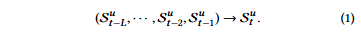

属于规则X→Y，

定义支持度计数sup(XY)，是指在序列中按规则顺序出现X和Y的次数，置信度sup(XY)，是指在出现X的序列中，Y在X之后发生的百分比。通过将右侧改为Sut+1或Sut+2，该规则也可以捕捉到一或两步跳跃的影响。

在 Movielens和Gowalla 进行筛选置信度大于50的规则

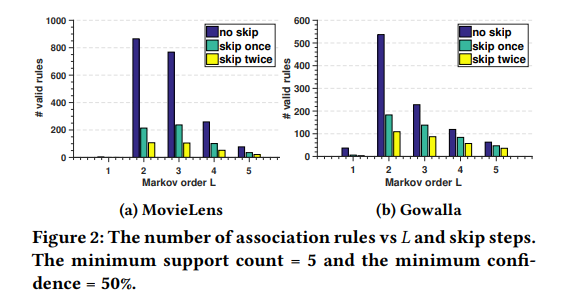

可见考虑跳跃行为是合理的。

#### model

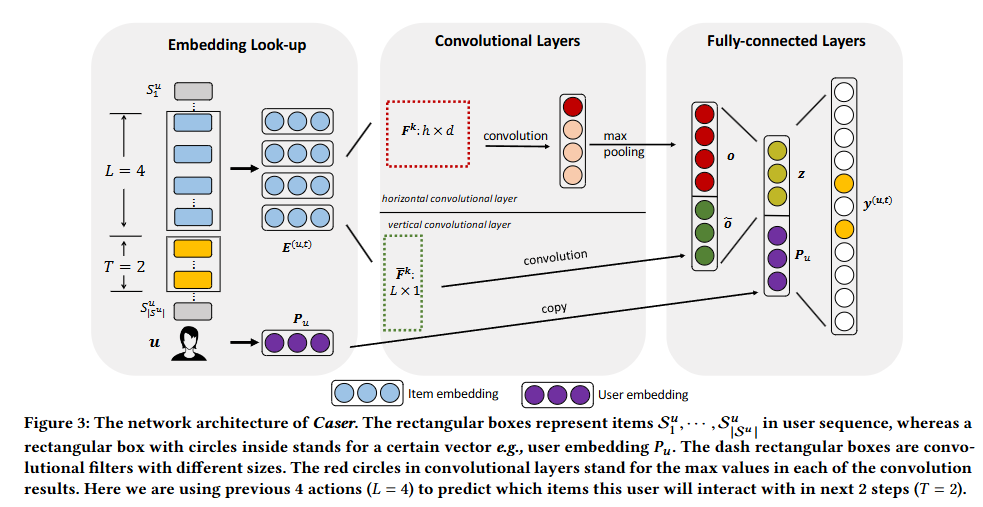

##### embed

从用户的序列 Su 中提取每 L 个连续项目作为输入，以及它们的下 T 个项目作为目标。这是通过在用户的序列上滑动一个大小为 L + T 的窗口完成的，每个窗口生成一个用户 u 的训练实例，表示为一个三元组 (u, 前 L 项目, 下 T 项目)。

项目 i 的嵌入 Qi ∈ R^d 堆叠得到用户 u 在时间步 t 的矩阵 E(u,t) ∈ R^{L×d}：

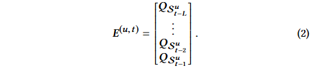

用户 u 嵌入 P_u ∈ R^d，表示用户在潜在空间中的特征。

##### conv

item 嵌入矩阵可以被看作图像，用滤波器提取 sequential patterns这种特征。

```
但是和cv的像素不同，embed矩阵并非初始定值，而是要和滤波器一同训练。
```

打个比方

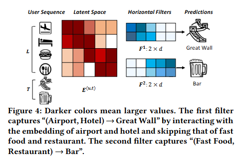

如上，两个“水平滤波器”，它们捕捉两个联合级的顺序模式。这些滤波器表示为 h × d 的矩阵，滤波器的高度为 h = 2，并且宽度等于 d。它们通过在 E 的行上滑动来捕捉顺序模式。例如，第一个滤波器通过在机场和酒店的潜在维度上有较大的值，捕捉顺序模式“(机场, 酒店) → 长城”。

###### 水平卷积

卷积层的上部分是水平卷积。

该层具有 n 个水平滤波器 F_k ∈ R^{h×d}，其中 1 ≤ k ≤ n。 h 的值为 {1, ···, L}

```
例如，如果 L = 4，可以选择 n = 8 个滤波器，每个 h 值（1、2、3、4）都有两个滤波器。通过滑动不同高度的滤波器，可以无论信号的位置如何都能够捕捉到显著信号。因此，水平滤波器可以被训练以捕捉具有不同联合大小的联合级模式。
```

**F_k** 将从 **E** 的顶部向底部滑动，并与 **E** 的所有水平维度交互，交互的结果是第 **i** 个卷积值，即、

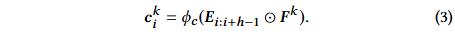

滤波器 **F_k** 的最终卷积结果是向量

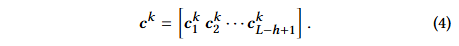

然后，我们对 **c^k** 应用最大池化操作，从该滤波器产生的所有值中提取最大值。最大值表示该滤波器提取的最显著特征。因此，对于该层中的 **n** 个滤波器，输出值 **o ∈ R^n** 为：

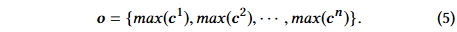

###### 垂直卷积

卷积层的下部分是垂直卷积。这层的符号都比水平卷积多个波浪线。

假设有 \tilde{n} 个垂直滤波器 \tilde{F_k} ∈ R^{L×1}，其中 1 ≤ k ≤ \tilde{n}。每个滤波器 \tilde{F_k} 与 E 的列交互，通过从左到右滑动 d 次，得到垂直卷积结果

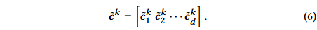

```
其实就是矩阵的行加权求和，权重滤波器对应行的值。相当于聚合了前 L个项目的嵌入。每个滤波器都充当了一个不同的聚合器
```

使用 \tilde{n} 个全局垂直滤波器为所有用户生成 \tilde{n} 个加权求和 \tilde{o} ∈ R^{d * \tilde{n}}：

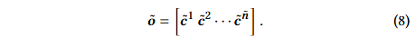

```
每个垂直滤波器的大小固定为 L × 1，因为 E 的每列都是潜在的，同时与多列交互是没有意义的。并且不需要应用最大池化操作，因为我们希望保留每个潜在维度的聚合结果。
```

###### 全连接层

将两个卷积层的输出连接起来，并将它们输入到一个全连接的神经网络层，以获取更高层次的抽象特征：

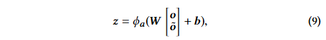

W ∈ R^{d * (n + d \tilde{n})} 是将连接层投影到 d 维隐藏层的权重矩阵，b ∈ R^d 是对应的偏置项，ϕa(⋅) 是全连接层的激活函数。z ∈ R^d 是我们称为的卷积序列嵌入，编码了之前 L 个项目的各种顺序特征。

为了捕捉用户的一般偏好，还查找用户的嵌入 **P_u**，与 **z**  连接在一起，组成 2d 长度的列向量，并将它们投影到具有 **|I|** 个节点的输出层中。

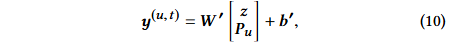

**b' ∈ R^{|I|}** 和 **W' ∈ R^{|I| \times 2d}** 分别是输出层的偏置项和权重矩阵。

```
z 旨在捕捉短期的顺序模式，而用户嵌入 P_u 捕捉用户的长期一般偏好。
```

#### train

使用 sigmoid 将输出转化为概率

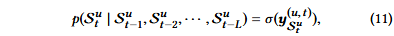

设 Cu = {L + 1， L + 2， ...， |Su |}是我们要对用户 u 进行预测的时间步长的集合。数据集中所有序列的可能性（负样本是随机选择的）

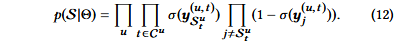

为了进一步捕获跳过行为，我们可以考虑下 T 个目标项 Dtu = {Stu ， Su t +1， ...， Su t+T }，方法是将上述等式中的下一个项 Stu 替换为 Dtu 。

取似然的负对数，我们得到目标函数

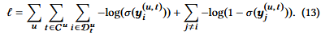

```
上式也称为二进制交叉熵损失
```

模型参数 Θ = {P， Q， F ， F ̃，W ，W ′， b， b′} 是通过最小化训练集上方程 （13） 中的目标函数来学习的，而超参数（例如，d、n、n ̃、L、T ）是通过网格搜索在验证集上进行调整的。

```
采用自适应矩估计 （Adam） 的随机梯度下降 （SGD） 变体，以实现更快的收敛，批处理大小为 100。正则化采用两个方法，L2 范数应用于所有模型参数，并且在全连接层使用丢弃率50%的 Dropout 具有。
```

#### perdict

取 u 的潜在嵌入 Pu 并提取方程 （2） 给出的他最后 L 项的嵌入作为神经网络输入。使用输出层 y 中值最高的 N 个项目。向所有用户提出建议的复杂度为 O（|U||I|d）。

#### 实验

没有直接使用公开数据集，而是对他们进行了顺序关联的规则挖掘，并计算它们的顺序强度。

定义 SI 估计顺序信号的强度

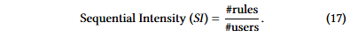

分子是使用support（即 5）和置信度（即 50%）找到的公式（1）形式的规则总数，分母是用户总数。

删除了冷启动项目和反馈小于 n 的项目

训练验证测试 712

指标 p r map

给定用户的前 N 个预测项目列表，表示为 R^1:N ，以及她/他的序列中最后 20% 的操作（即表示为 R（即测试集））


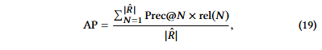

其中，如果 Rˆ 中的第 N 个项目在 R 中，则 rel(N ) = 1。平均精度 (MAP) 是所有用户的 AP 平均值。

result

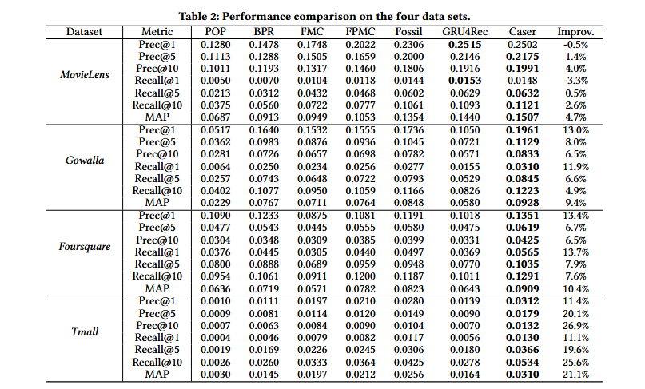

超参数研究

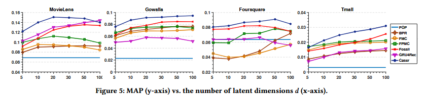

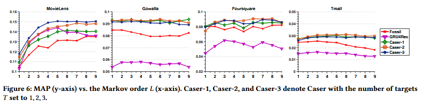

组件分析

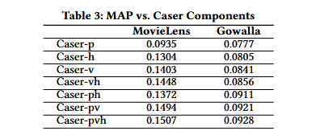

实例分析

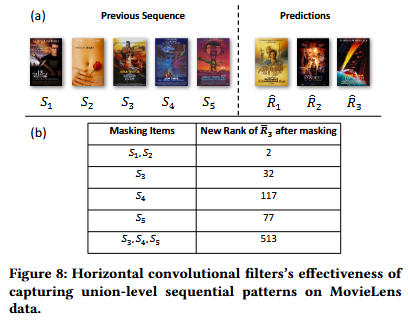

