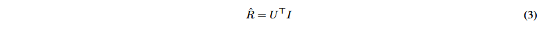

A COMPREHENSIVE REVIEW OF RECOMMENDER SYSTEMS:  TRANSITIONING FROM THEORY TO PRACTICE

### 基础推荐系统

推荐系统（下统称为RS），可以在数学上表示为一个函数f，该函数预测项目 i 对用户 u 的效用，表示为 r^ui，它估计用户 u 对项目 i 的偏好程度。此功能通常是从历史数据中学习的：


其中 θ 表示从数据中学习到的模型参数。在 RS 的上下文中，术语 rˆui 表示用户将分配给项目的评级或效用的预测。此预测用于推荐用户可能感兴趣的项目。 RS 的总体框架如下图所示。RS 中数据驱动模型的生命周期从数据采集开始，然后是存储和准备。这导致了特征工程，形成了数据管道的基础。数据管道输入训练管道，其中包括模型训练和验证。最后过程涉及候选生成和排名。此过程辅以 A/B 测试、离线和/或在线评估。最后阶段包括部署和监控。


#### 基础推荐系统

基础RS是指建立推荐引擎领域核心原理和方法的早期模型和技术。这些系统主要包括协作过滤（collaborative filtering）、基于内容的过滤（content-based filtering）和混合方法（hybrid approaches）。其演变历程如下图所示。


##### content-based filtering

基于内容的过滤（**CBF**）是一种推荐策略，它根据项目的属性和用户偏好的概况向用户推荐项目，通常利用相似性度量来将用户偏好与项目属性相匹配[83]。在 CBF 中，推荐 rˆui 基于项目 φ(i) 的特征和用户偏好的概况 θ(u)：


```
φ(i) 表示该项目的特征向量， θ(u) 表示用户偏好向量。
```

CBF推荐模型的演变始于向量空间模型、概率模型和决策树等传统方法[83]，依赖于手动特征工程和相似性计算。向量空间模型通过余弦相似度计算项目相似度[84]，概率模型通过统计分析估计用户偏好的可能性[85]，决策树通过基于属性对项目进行分类来推荐项目[83]。这些模型通过利用明确的项目特征和用户偏好，为个性化推荐奠定了基础。

计算机科学和机器学习方法的算法进步导致了向复杂神经网络的转变，该网络允许自动特征提取和学习复杂的数据模式[86]。这些基于神经网络的系统利用深度学习来分析不同模式的用户交互和项目特征，包括文本（例如评论[87]、引文[88]和新闻[89]）、流媒体（例如音乐[77]） ，和图像数据[90]。这些进步的总体目标是通过将用户配置文件与项目特征相结合来生成个性化推荐。

###### CBF 面临的挑战

一般来说，CBF 面临着冷启动问题、过度专业化（仅建议与用户已经看过或喜欢的项目类似的项目）、计算成本（随着项目数量的二次方或三次方增加）等挑战。用户和项目），并且缺乏对用户和项目配置文件的更新。

##### Collaborative Filtering

协同过滤（CF）是RS使用的一种技术，用于根据类似其他用户的偏好来预测用户的偏好[34]。 CF 技术大致分为两大类：**基于记忆**（memory-based）的方法和**基于模型**（model-based）的方法。

基于记忆的 CF 直接根据用户评分使用用户或项目之间的相似性进行推荐。它还有两种类型：基于用户（user-based）的CF根据相似用户的历史评分来预测用户评分[70]，而基于物品（item-based）的CF根据相似的项目来预测评分[91]。两种方法都面临可扩展性和稀疏性等挑战。

基于模型的CF，如矩阵分解[92]和分解机[93]，揭示了代表用户偏好和项目特征的潜在因素。这些方法将用户-项目交互矩阵分解为用户和项目的潜在特征向量。

CF 通常从构建用户-项目交互矩阵 R 开始，其中用户、项目和 rui 表示用户和项目之间已知的交互。 CF 中一种流行的方法是矩阵分解 [92]，其中 R 由两个低维矩阵 U（用户特征）和 I（项目特征）的乘积来近似：



U 是一个 k × m 矩阵，其中 k 是潜在因子的数量，m 是用户的数量， I 是一个k × n 矩阵，其中n 是项目数。

CF 中的神经网络可以改进了这些 RS，利用深度学习捕获复杂的用户-项目关系并显着提高推荐准确性。神经协同过滤 (NCF) [94]、序列感知 RS [95] 和图神经网络 (GNN) [48] 等技术已成为 CF 中最先进的方法。  

###### CF 的挑战

与 CBF 一样，这些方法更加准确和稳健，但它们也带来了计算复杂性和可解释性有限等挑战，这可能会阻碍它们在现实场景中的可扩展性和实际适用性。

##### Hybrid Approaches

混合RS结合了多种推荐技术，例如CBF、CF和其他ML模型，以提高向用户提供的推荐的准确性和相关性。最常见的混合技术包括加权组合、切换选择、特征组合、级联和特征增强[96]。该组合可以表示为加权和：


fCB 和 fCF 分别代表基于内容的过滤功能和协同过滤功能、θCB 和θCF 是各个模型的参数、α 和β 是平衡每种方法贡献的权重。

Wide & Deep Learning 框架 [97]、神经分解机 (NFM) [98]、DeepFM [99] 和 Deep & Cross 网络 [100] 等技术结合了显式特征交互和隐式特征层次结构，同时利用了浅层和深层增强推荐的学习模型。

基础推荐系统（RS），包括协同过滤（CF）、基于内容的过滤（CBF）和混合方法，构成了许多个性化推荐解决方案的核心。虽然这些系统在各个行业中已被证明有效，但它们在应对如电子商务、娱乐、新闻、旅游、金融、医疗保健和电子学习等领域的实际挑战时，往往表现有限。

例如，CF可以通过利用行为数据为新闻推荐系统 [59] 或音乐推荐系统 [42] 个性化用户体验，但在应对用户偏好的动态变化和实时推荐需求方面存在困难。在旅游、金融、医疗保健和电子学习等领域，基础推荐系统能够理解用户偏好和行为模式，但冷启动问题、数据多样性、隐私问题以及对高度个性化服务的需求等问题，需要更复杂的解决方案。这些解决方案通常将基础技术与深度学习和专业化推荐系统等现代进展相结合（将在下文讨论）。

#### DeepLearning in RS

近年来，深度学习已成为 RS 的标准，相关调查对此进行了详细介绍 [86]。在本次讨论的背景下，我们对一些流行的基于 RS 的深度神经网络进行了一些阐述。

##### DL-based RS

###### Multi-Layer Perceptrons（MLP）

传统的 RS 主要使用矩阵分解等线性方法[92]，这些方法很难捕获复杂的用户-项目交互。相比之下，多层感知器 (MLP)（一种前馈神经网络）使用深层来更准确地对这些非线性交互进行建模，从而提高预测精度和推荐质量。 MLP 的演变可以在 RS 中看到，例如神经协同过滤 (NCF) [94]、深度分解机 (DFM) [99]、Wide & Deep [97]、xDeepFM [141]、Deep & Cross Network (DCN) [ 100]、FMLP-Rec [142]（一种具有可学习滤波器的模型，用于改进顺序推荐）以及 FinalMLP [143]（它将双 MLP 架构与特征选择相结合）有效的点击率 (Click-Through Rate——CTR) 预测。

```
MLP 的挑战：尽管取得了成功，RS 中的 MLP 模型仍然面临着复杂性、过度拟合风险、缺乏空间不变性、梯度消失或爆炸问题以及可解释性问题等挑战。
```

###### AutoEncoders

自动编码器是专门为无监督学习设计的神经网络架构，用于有效的降维方法。自动编码器包含两个组件：用于将输入数据压缩为低维表示的编码器（encoder）和用于重建原始数据的解码器（decoder）。与传统 MLP 模型不同，自动编码器显式捕获这种编码-解码结构。

著名的 RS 包括 AutoRec [144]、协作过滤自动编码器、多变分自动编码器 (MultiVAE) [145]、深度推荐器 (DeepRec) [146]、推荐变分自动编码器 (RecVAE) [147]、基于项目的变分自动编码器用于公平推荐的编码器[148]，以及变分带宽自动编码器（VBAE）混合RS [149].这些方法解决了稀疏性和噪声挑战，使其能够有效地提供个性化推荐。

```
AE 的挑战：自动编码器对于降维和捕获复杂的数据结构非常强大，但一个关键问题是它们对噪声的敏感性，如果输入数据有噪声，这可能会导致重建效果不佳[150]。此外，重建过程可能并不总是保留对建议至关重要的有意义的模式。
```

###### CNN

CNN可以从视觉、顺序和多模式数据中学习，并提高推荐的准确性和个性化。 CNN 已在各种环境中应用于 RS。 DeepCoNN 分析文本和视觉线索以了解用户偏好 [87, 151]。 CNN 与可扩展推荐系统的图结构集成[120]，在 DKN 中用于新闻推荐[152]，在 MusicCNN 中用于基于音频信号的音乐推荐[153]。基于 CNN 的 RS 模型预测下一项推荐 [130]，通过 CoCNN [154] 识别用户偏好模式，并利用 CAGCN [155] 的协同过滤。

```
CNN 的挑战：RS 中的 CNN 面临数据稀疏、可扩展性、隐私和特定领域问题等挑战[156]。研究人员继续探索增强基于 CNN 的 RS 性能和可用性的解决方案
```

###### RNN


#### advanced modeling

##### gNN

##### sequential & session-based

顺序推荐通常被视为下一个项目或下一个篮子的预测挑战[37]。顺序 RS 和基于会话的 RS 都利用用户操作序列来预测用户未来的偏好 [95]。具体来说，顺序 RS 考虑用户的交互历史来预测未来的行为或用户的偏好。相比之下，基于会话的 RS（调查[38]中详细介绍）专注于短期用户活动以进行实时推荐。这些方法共同增强了跨平台的个性化和相关性。

顺序RS模型可以定义为：i_next = f(history(u))，其中inext是下一个推荐项目，history(u)是用户u的交互序列，f对顺序行为进行建模以预测未来的交互。

基于会话的RS模型可以定义为：i_session-next = g(s_current)，其中i_session-next作为即将发生的会话推荐，s_current代表正在进行的会话交互，g根据会话的上下文预测下一个项目。

顺序和基于会话的 RS 通过捕获用户行为中的时间动态和顺序模式来有效解决实际挑战。 TransRec、GRU4Rec 和 GRU4Rec+ 等模型使用循环神经网络来确保可扩展性和计算效率，使其成为电子商务和视频流的理想选择。 Caser 和 NextItNet 通过卷积层增强了这些功能，从而提高了准确性。 SASRec 和 SR-GNN 应用自注意力机制和图神经网络来捕获电子商务和视频游戏中复杂的用户-项目交互。 BERT4Rec 和 Transformers4Rec 利用 Transformer 架构对远程依赖关系进行建模，从而在 Amazon Beauty、Steam 和 MovieLens 等数据集上实现高精度。  这些模型还能够通过考虑短期基于会话和长期顺序偏好来解决数据稀疏和冷启动问题。它们适应快速变化的用户兴趣并提供实时推荐，使其在娱乐和新闻等行业中发挥作用。例如，在新闻行业，他们提供及时且相关的文章。在电子商务中，它们跟踪会话中的用户交互，以提供上下文相关的产品建议，从而增强购物体验并增加立即购买的可能性。表 7 进一步详细介绍了这些系统的实际应用和使用。
