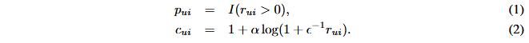

Deep content-based music recommendation

##### 0

绝大多数的推荐系统以来CBF进行推荐，具有冷启动问题，例如在自动音乐推荐领域，对于推荐的新的和冷的歌曲不太有效（因为没有数据）。

在本文中，使用潜在因子模型进行推荐，并在无法从使用数据中获得潜在因因子时从音乐音频中预测潜在因子。

具体来说，就是利用CNN获得音频的向量表示。

##### 加权矩阵分解

模型数据来自于The Taste Profile Subset的子集，其包含了每首歌曲和每个用户的播放次数，这是一种隐式反馈。

我们可以假设，如果用户喜欢歌曲，他们可能会更频繁地听歌曲。如果用户从未听过一首歌，这可能有很多原因：例如，他们可能不知道这首歌，或者他们可能不希望喜欢它。

因此本文使用改良的**加权矩阵分解**算法，以学习潜在因子表示。

令 rui 为用户 u 和歌曲 i 的播放次数。对于每个用户-项目对，我们定义一个偏好变量 pui 和一个置信度变量 cui （I(x) 是指示函数，α 和 c 是超参数）：

偏好变量指示用户u是否曾经听过歌曲i。如果为 1，我们将假设用户喜欢这首歌。置信度变量衡量我们对这一特定偏好的确定程度。它是播放次数的函数，因为播放次数较高的歌曲更有可能受到青睐。如果歌曲从未被播放过，则置信度变量的值将会较低，因为这是信息量最少的情况。

其目标函数由置信加权均方误差项和 L2 正则化项组成

其中 λ 是正则化参数，xu 是用户 u 的潜在因子向量，yi 是歌曲 i 的潜在因子向量。

请注意，第一个总和涵盖所有用户和所有歌曲：与评级预测的矩阵分解相反，其中与没有可用评级的用户-项目组合相对应的术语可以被丢弃，我们必须考虑所有可能的组合。因此，对于这种大小的数据集，使用随机梯度下降进行优化是不切实际的。胡等人。提出了一种有效的**交替最小二乘**（ALS）优化方法，我们改为使用它。

##### 音频到潜在因子

本质上是要学习一个时序序列到实数向量的函数，本文采用了CNN的方法，同时也将其和传统词袋方法进行了对比。

上一节中通过WMF获得的潜在因子向量被用于模型的训练。

###### Bag-of-words

暂略

###### CNN

CNN的输入是一种通过神奇方法得到的音乐的频谱图，对剪辑音频中随机采样的3秒窗口上进行训练。

CNN特别适合预测音乐音频中的潜在因素，因为它们允许在不同因素之间共享中间特征，并且因为它们由交替的特征提取层和池化层组成的层次结构允许它们在多个时间尺度上运行。

令 yi 为通过 WMF 获得的歌曲 i 的潜在因子向量，y′ i 为模型的相应预测。目标函数为（θ 代表模型参数）：

##### 实验

暂略
