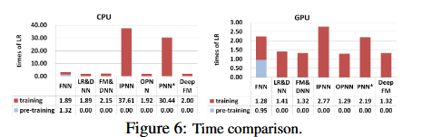
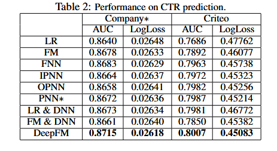

DeepFM: A Factorization-Machine based Neural Network for CTR Prediction

#### -1

特征的低阶&高阶交互

低阶：特征之间简单、线性的相互作用，通常只涉及一到两个特征的直接影响，如线性回归模型 y = wT x + b。

高阶：高阶交互则是指多个特征之间复杂的、非线性的相互作用。这些特征的组合可能通过复杂的方式共同影响目标变量。比如青少年男性偏爱FPS游戏，这种三阶交互可以对CTR提供帮助。

#### -0.5

因此如何建模特征交互式很交互的。上一节提到的FPS实例是很容易通过经验指定的，及特征工程。然而数据挖掘一个有趣的实例是在超市购买尿布的人往往会买啤酒，这种隐式特征是很难通过经验指定的。

同时在数据量很大时特征工程也很困难。

#### 0

现有的方法只能较好的处理低阶or高阶交互，或者需要特征工程（W&D）。

本问提出了一种兼顾低阶高阶交互的端到端学习模型，具体来说对于低阶问题使用FM （Factorization-Machine），高阶使用 DNN。

与 W&D 相比，DeepFM在两部分共享输入，同时在原始特征外不需要额外的特征工程。

#### model

训练数据由 n 个实例 （X，y）构成，其中 χ 是 m 字段数据记录，通常涉及一对用户和项目，y ∈ {0, 1} 是指示用户点击行为的关联标签（y = 1 表示用户单击了该项目，否则 y = 0）。 χ 可以包括分类字段（例如，性别、位置）和连续字段（例如，年龄）。每个分类字段表示为一个one-hot编码的向量，每个连续字段表示为值本身，或者离散化（区间化）后的one-hot编码的向量。

然后，每个实例都转换为 (x, y)，其中 x = [xfield1 , xfield2 , ..., xfiledj , ..., xfieldm ] 是一个 d 维向量，其中 xfieldj 是第 j 个字段的向量表示χ。通常，x 是高维且极其稀疏的。

CTR预测的任务是建立一个预测模型y^ = CTR model(x)来估计用户在给定上下文中点击特定应用程序的概率。

对于特征 i，标量 wi 用于衡量其 1 阶重要性，潜在向量 Vi 用于衡量其与其他特征交互的影响。 Vi 被馈送到 FM 组件中以建模 2 阶特征交互，并被馈送到深度组件中以建模高阶特征交互。所有参数，包括 wi、Vi 和网络参数（下面的 W(l)、b(l)）均针对组合预测模型进行联合训练：

其中 yˆ ∈ (0, 1) 是预测的 CTR，yF M 是 FM 组件的输出，yDNN 是深度组件的输出。

##### FM侧

FM的输出是一个加法单元和多个内积单元的总和：

其中 w ∈ Rd 且 Vi ∈ Rk（k 给定）2。加法单元 (<w, x>) 反映了 1 阶特征的重要性，内积单元表示了 2 阶特征交互的影响。

##### DNN 侧

传统的前馈网络，并在输入网络前通过embedding 将向量嵌入到低维。

如上是 embedding 过程的详解，可以看到，不同特征嵌入到了相同的维度，并且网络权重是FM中的潜在向量，embedding层的输出表示为

其中 ei 是第 i 个字段的嵌入，m 是字段的数量。然后将a(0)输入到深度神经网络中，前向过程为：

其中 l 是层深度，σ 是激活函数。 a(l)、W(l)、b(l) 是第 l 层的输出、模型权重和偏差。之后，生成稠密实值特征向量，最后将其输入到 sigmoid 函数中进行 CTR 预测： yDNN = σ(W |H|+1 · aH + b|H|+1)，其中 |H|是隐藏层的数量。

相比W&D需要对输入进行额外的特征工程（如下图），DeepFM中的俩个部分共享相同的特征嵌入。（论文还比较了FNN和PNN，没看过，暂略）

雷氏对比

#### 实验

##### 效率

##### 性能

##### 超参数探究

激活函数 relu>tanh

dropout

神经元数量，（神经元过多会发生过拟合。

隐藏层数量，同样，层数过多会过拟合

网络形状——不同层间的神经元分布。

