Filter-enhanced MLP is All You Need for Sequential Recommendation.

什么公式标题。。

#### 0

序列推荐，旨在从用户历史行为数据中捕捉特征以进行推荐。一个常见问题是数据具有噪声，深度模型通常会对其过拟合。本文借鉴信号处理的滤波 filtering 算法，采用MLP+Filtering代替Trnsformer的多头注意力。即FMLP-Rec。

#### -1

Sequential Recommendation。用户的行为是动态的并且随着时间的推移而演变。因此，捕获用户行为的顺序特征对于做出适当的推荐至关重要，这是顺序推荐的核心目标。

u ∈ U 表示用户，i ∈ I 表示项目。对于带有隐式反馈的顺序推荐，用户 u 有一个上下文 c，一个按时间顺序排列的项目交互序列：c = {i1, · · · , in }.序列推荐即预测用户可能在第 (n + 1) 步骤交互的下一个项目，表示为 p (i_n+1|i_1:n)。

#### -0.5

傅里叶变换。考虑一维{xn } with n ∈ [0, N − 1]。其通过以下公式转化为频域

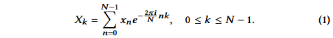

对于每个 k，DFT 都会生成一个新的表示 Xk，作为所有原始输入标记 xn 与所谓的“旋转因子”的总和（？）。这样，Xk 表示序列{xn } 在频率ωk = 2πk/N 处的频谱。

请注意，DFT 是一对一的（可逆）转换。给定 DFT Xk ，我们可以通过逆 DFT (IDFT) 恢复原始序列 {xn }：

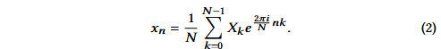

```
FFT，能将DFT的计算复杂度下降至 nlogn， 
```

FFT获得的频域信号再通过一些滤波算法去掉噪声。

值得注意的是，直接删除噪声是很难的，我们只是尽力得到噪声影响较小的新信号表示。

#### -0.2验证滤波有效性

选择GRU4Rec [17] 和 SASRec [22] 进行实验。上述模型很大程度上遵循深度序列模型的标准框架——由嵌入层、序列编码器层和预测层组成，只是序列编码器层分别采用RNN和Transformer。

尽管这两个模型显示出了有希望的结果，但它们可能对用户行为序列中的噪声不具有鲁棒性。因此，我们直接添加一个非参数过滤层位于两个模型的嵌入层和序列编码器层之间，并且不改变其他组件。  

在过滤层中，给定项目序列的嵌入矩阵，我们对特征的每个维度进行以下操作：FFT→过滤算法→IFFT。滤波后，我们将去噪后的嵌入矩阵作为序列编码器层的输入。

滤波算法： 高通滤波器（HPF）通过较高频率的信号并衰减较低频率的信号。 FFT 后，我们将信号低频一半的值设置为零；低通滤波器(LPF) 使低频信号通过并衰减高频信号。 FFT 后，我们将信号的高频一半的值设置为零；带阻滤波器(BSF) 衰减中频信号，并让其他信号通过。 FFT之后，我们将信号的中频一半的值设置为零。

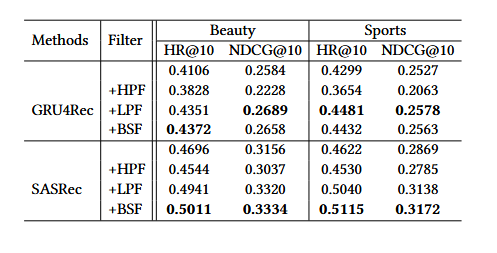

（数据集是Amazon 的 Beauty and Sports datasets。

可见，去噪确实是必要的，但是具体算法因模型而异。神奇的是，低频信号对序列推荐有意义的。

```
这与其他领域如水文学、地震学和人类行为学发现的——自然界和人类行为中的低频信号通常是有意义的周期性特征是一致的（一作是做ai+地球物理的）
```

接着删除基于Transformer的序列编码器层中的多头自注意力块，但在嵌入层之后添加了一个过滤层。过滤算法同上。

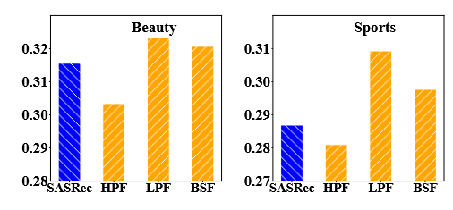

可见，在删除多头自注意力块后，大多数模型变体仍然表现良好。带 LPF 的变体模型甚至大幅优于 SASRec 模型。

这表明适当的过滤算法可以激发简单的全 MLP 模型超越复杂的基于 Transformer 的模型的潜力。通过去除噪声信息和自注意力块，模型更加轻量级，从而降低了过度拟合的风险。

基于上述分析，有希望设计一种有效且高效的全 MLP 模型，并具有适当的过滤算法来进行顺序推荐。

#### 1-model

可见 filtering + allMLP 架构可以产生非常好的推荐性能。

然而，过滤算法通常需要领域知识或专家努力来设计适当的过滤器和设置超参数（例如过滤阈值）。将过滤算法有效地集成到现有的深度推荐框架中仍然是一个挑战。

在本节中，我们提出了一种用于顺序推荐的全 MLP 架构（称为 FMLP-Rec），通过将 MLP 块与可学习过滤器堆叠在一起，该架构可以自动学习适合各种顺序推荐场景的适当过滤器。

##### embed

嵌入层维护一个所有项目嵌入矩阵 MI ∈ R|I |×d ，将项目的高维onehot表示投影到低维稠密表示。对于一个 n 长度的项目序列，利用 MI 形成输入嵌入矩阵 E ∈ Rn×d 。

此外，我们结合了一个可学习的位置编码矩阵 P ∈ R n×d 来增强项目序列的输入表示。二者相加得到序列表示 EI ∈ Rn×d。

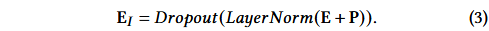

```
使用dropout 和层归一化操作来缓解因随机初始化嵌入矩阵带来的梯度消失，训练不稳定等影响
```

##### filter-enhance block

编码器我们堆叠多个滤波器块，其由滤波器层+前馈层组成

###### filter layer

第 l 层的输入项表示矩阵 Fl ∈ Rn×d（当 l = 0 时，我们设置 F0 = EI ），先沿项维度进行 FFT，将 Fl 转换到频域：

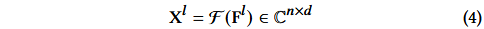

乘以可学习滤波器 W ∈ Cn×d 来调制频谱

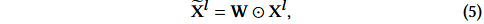

其中 ⊙ 是逐元素乘法。最后采用逆FFT将调制频谱~Xl变换回时域并更新序列表示

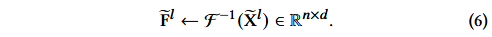

也使用残差，LN，dropout

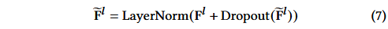

###### feedfoward

使用MLP捕捉非线性特征

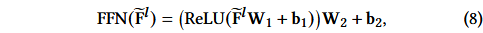

再执行如式7的操作得到 l 层的输出

##### perdiction

最后一层在用户历史记录的上下文中计算步骤（t + 1）中用户对项目 i 的偏好得分

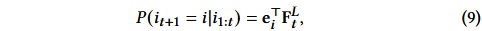

ei 是项嵌入矩阵 M I 中项 i 的表示，FL t 是第 t 步 L 层可学习滤波器块的输出，L 是可学习滤波器块的数量。

###### loss

成对排名损失

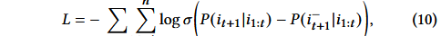

