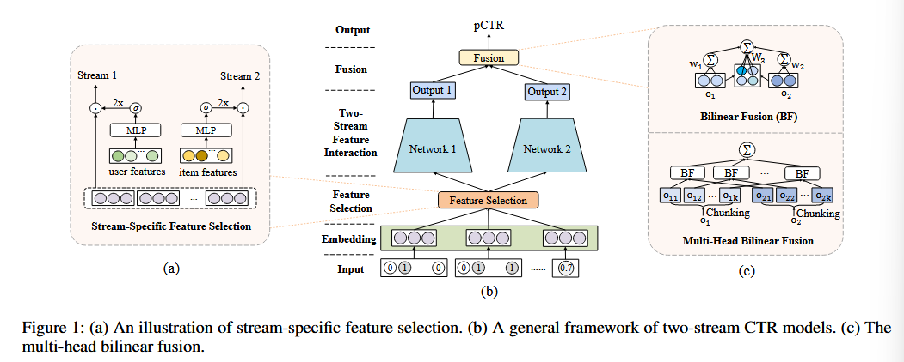

FinalMLP: An Enhanced TwoStream MLP Model for CTR Prediction.

#### 0

单独应用普通 MLP 网络在学习乘性特征交互方面效率低下。因此，通过将 MLP 网络与另一个专用网络集成来增强 CTR 预测，已经提出了许多双流交互模型（例如 DeepFM 和 DCN）。由于 MLP 流隐式学习特征交互，现有研究主要集中在增强互补流中的显式特征交互。

相比之下，我们的实证研究表明，简单地组合两个 MLP 的经过良好调整的双流 MLP 模型甚至可以实现令人惊讶的良好性能，这是现有工作之前从未报道过的。

基于这一观察，我们进一步提出了特征门控和交互聚合层，可以轻松插入这些层以制作增强的双流 MLP 模型 FinalMLP。这样，它不仅可以实现差异化的特征输入，还可以有效地融合两个流之间的流级交互。

#### model

##### dualMLP

