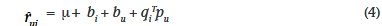

Matrix factorization techniques for recommender systems

##### 0

矩阵分解的经典之作，考虑了四种trick与模型结合。[原文](https://ieeexplore.ieee.org/abstract/document/5197422)

##### 预备知识

在此之前，介绍两种经典的协同过滤（CF）推荐方法。

一是邻域方法（neighborhood methods），如下图所示。是一种基于user的邻域方法。


joe喜欢左边的三部电影。为了对他进行预测，系统会找到也喜欢这些电影的相似用户，然后确定他们喜欢哪些其他电影。在这种情况下，三个人都喜欢《拯救大兵瑞恩》，所以这是第一个推荐。其中两人喜欢《沙丘》，所以这是下一个，依此类推。

二是隐因子模型（latent factor models）

其试图通过将物品和用户描述为基于评分模式推断出的 20 到 100 个因子来解释评分。下图是一个例子。


考虑两个假设的维度，分别是女性导向与男性导向、严肃导向与逃避现实导向。该图显示了几部知名电影和一些虚构用户可能落在这两个维度上的位置。

对于此模型，用户对电影的预测评分相对于电影的平均评分将等于图表上电影和用户位置的点积。例如我们会假定 Gus 喜欢《阿呆与阿瓜》，讨厌《紫色》，并对《勇敢的心》评价为一般。请注意，某些电影（例如《十一罗汉》）和用户（例如戴夫）在这两个维度上会被描述为相当中立。

##### 矩阵分解方法

隐因子的成功是基于矩阵分解方法的，在其基本形式中，矩阵分解通过从项目评分模式推断出的因子向量来表征项目和用户。当user和item因子高度一致时会导致推荐的发生。

推荐系统依赖于不同类型的输入数据，这些数据通常放置在一个矩阵中，其中一个维度代表用户，另一个维度代表感兴趣的项目。

最方便的数据是高质量的显式反馈，其中包括用户关于他们对产品的兴趣的显式输入。

例如，Netflix 收集电影的星级，TiVo 用户通过按“拇指向上”和“拇指向下”按钮来表明他们对电视节目的偏好。我们将明确的用户反馈称为**评级（ratings）**。通常，显式反馈包含稀疏矩阵，因为任何单个用户可能只对一小部分可能的项目进行了评分。

矩阵分解的优点之一是它允许合并附加信息。当无法获得显式反馈时，推荐系统可以使用隐式反馈（implict feedback）来推断用户偏好，隐式反馈通过观察用户行为（包括购买历史记录、浏览历史记录、搜索模式甚至鼠标移动）来间接反映意见。隐式反馈通常表示事件的存在或不存在，因此它通常由密集填充的矩阵表示。

##### 基本模型

矩阵分解模型将用户和项目映射到维度为 f 的联合潜在因子空间，以便将用户-项目交互建模为该空间中的内积。每个item都与一个向量关联  qi ∈ R^f，每个user与一个向量pu ∈ R^f。如下，user矩阵的每一行是user的pu，item矩阵的每一列是item的qi。


对于给定的项目 i，qi 的元素衡量该项目拥有这些因素（正面或负面）的程度。对于给定的用户 u，pu 的元素衡量用户对相应因素（同样是正面或负面）较高的项目的兴趣程度。

得到的点积 **qiT pu** 捕获了用户 u 和项目 i 之间的交互——用户对项目特征的总体兴趣。这近似于用户 u 对项目 i 的评分，用 rui 表示，从而得出估计


主要的难点就是如何得到映射，完成此映射后，可以使用上述公式轻松估计用户对任何项目的评分。

###### 如何分解？

常见的矩阵分解技术如（SVD）需要考虑用户-项目评分矩阵。由于用户-项目评分矩阵的稀疏性导致大量缺失值，这通常会带来困难。当矩阵知识不完整时，传统的 SVD 是不确定的。此外，只处理相对较少的已知条目很容易出现过度拟合。

早期的系统依靠插补来填充缺失的评级并使评级矩阵变得密集。然而，插补可能非常昂贵，因为它会显着增加数据量。此外，不准确的估算可能会严重扭曲数据。

因此我们考虑利用矩阵中已有的值，期望 **qiT pu** 尽可能地接近这些值。得到 user 和 item 矩阵后，就可以恢复出完整的 user-item 评分矩阵，以此预测 user 对于没有评分过的 item 的评分。

为了学习因子向量（pu 和 qi），系统最小化已知评级集的正则平方误差：


ru 是实际评分 ， κ 是已知 rui 的 (u,i) 对的集合（训练集）。常数 λ 控制正则化的程度，通常由交叉验证确定。 Ruslan Salakhutdinov 和 Andriy Mnih 的“概率矩阵分解”7 为正则化提供了概率基础。

##### 模型的学习

对于公式（2）使其最小化。可以使用SGD和交替最小二乘法（ALS）

###### stochastic gradient descent

对于每个给定的训练案例，系统预测 rui 并计算相关的预测误差


然后，它在梯度的相反方向上按与 /gama 成比例的幅度修改参数，产生：


其易于实施，速度更快

###### alternating least squares

公式（2）的变量是未知的，不是凸函数，即不能通过梯度下降获得最优解。

ALS的方法是，固定其中的一个变量，问题可以得到解决——交替对 qi 和 pu 使用最小二乘法，直至收敛。

具体来说，比如固定 qi ，公式（2）变为关于 pu 的二次函数，并可以通过求导获得其最优解。

##### adding bias

公式1中的结果的差异可能是由于用户或者项目的影响，并不能反映真实的交互信息，比如一些人总是喜欢给出较高的ratings，一些项目也会获得较高的ratings（仅仅是因为习惯）。因此，我们尝试去描述这种偏差，称其为bui。其一阶近似如下。


总体平均评分用μ表示；参数 bu 和 bi 分别表示观察到的用户 u 和项目 i 与平均值的偏差。

```
例如，假设您想要对用户 Joe 对电影《泰坦尼克号》的评分进行一阶估计。现在，假设所有电影的平均评分 μ 为 3.7 星。此外，《泰坦尼克号》比一般电影要好，因此它的评分往往比平均水平高 0.5 星。另一方面，Joe 是一位挑剔的用户，他的评分往往比平均水平低 0.3 星。因此，Joe 对《泰坦尼克号》的评级估计为 3.9 星 (3.7 + 0.5 - 0.3)。
```

因此公式1调整为



公式2调整为


##### 额外的输入

为了缓解冷启动问题，RS可以采用隐式反馈了解用户的偏好。

为简单起见，考虑具有布尔隐式反馈的情况。 N(u) 表示用户 u 表达隐式偏好的项目集合。这样，系统就可以通过用户隐式偏好的项目来分析用户。这里，需要一组新的项目因子，其中项目 i 与 xi ∈ R f 相关联。因此，对 N(u) 中的项目表现出偏好的用户由向量来表征。

另一个信息源是已知的用户属性，例如人口统计数据。再次，为了简单起见，考虑布尔属性，其中用户 u 对应于属性集 A(u)，它可以描述性别、年龄组、邮政编码、收入水平等。一个不同的因子向量 ya ∈ R f 对应于每个属性，通过用户关联的属性集来描述用户。

因此在增强用户表示的前提下，公式（4）可以调整为


其中倒数第二项使用了正规化。

##### 动态模型

人们的喜好会随着时间推移而改变，引入时间变量。


##### 置信等级

并非所有的ratings都有置信度，包括一些隐式反馈难以量化用户的ratings，因此有必要引入置信度的指标。例如，用户观看特定节目的时间或用户购买特定商品的频率。这些数值表示每个观察结果的置信度。

如果观察 rui 的置信度表示为 cui，则公式（5）调整为


##### 实验

该模型在NetFilx的大赛获得第一名，


上图展示了考虑不同因子模型带来的提升（错误率下降）。横坐标是参数数量，提高参数数量准确性也会提升。

