Neural Collaborative Filtering

#### 0

神经协同过滤NCF。来自WWW 2017。[原文](https://arxiv.org/abs/1708.05031)。

之前已有一些工作利用DNN进行推荐任务，但是其主要使用DNN进行建模辅助信息如

（ [38] H. Wang, N. Wang, and D.-Y. Yeung. Collaborative deep learning for recommender systems. In KDD, pages 1235–1244, 2015.

[45] F. Zhang, N. J. Yuan, D. Lian, X. Xie, and W.-Y. Ma. Collaborative  knowledge base embedding for recommender systems. In KDD, pages 353–362, 2016.）

，在关键的协同过滤效果时仍采用MF，利用内积结合用户和项目的特征。

本文基于神经网络的技术，在隐式反馈的基础上解决RS中的协同过滤问题。具体来说，其采用MLP来学习user-item交互函数，并设计了一个通用框架NCF。

#### 一些预备知识

##### 隐式数据

让 M 和 N 分别表示用户和项目的数量。我们根据用户的隐式反馈将用户-项目交互矩阵 Y ∈ RM×N 定义为：


这里 yui 的值为 1 表示用户 u 和项目 i 之间存在交互；然而，这并不意味着你真的喜欢我。同样，值为 0 并不一定意味着 u 不喜欢 i，可能是用户不知道该项目。这给从隐式数据中学习带来了挑战，因为它只提供有关用户偏好的噪声信号。虽然观察到的条目至少反映了用户对项目的兴趣，但未观察到的条目可能只是缺少数据，并且自然缺乏负面反馈。

具有隐式反馈的推荐问题被表述为估计 Y 中未观察到的条目的分数的问题，该分数用于对条目进行排名。

基于模型的方法假设数据可以由底层模型生成（或描述）。形式上，它们可以抽象为学习 yˆui = f (u, i|θ)，其中 yˆui 表示交互的预测得分 yui，θ 表示模型参数，f 表示将模型参数映射到预测得分的函数（我们称之为交互函数）。

为了估计参数 θ，现有方法通常遵循优化目标函数的机器学习范式。文献中最常使用两种类型的目标函数——逐点损失 [14, 19] 和成对损失 [27, 33]。作为大量显式反馈工作的自然延伸[21, 46]，逐点学习方法通常遵循回归框架，通过最小化 yˆui 与其目标值 yui 之间的平方损失。为了处理负面数据的缺失，他们要么将所有未观察到的条目视为负面反馈，要么从未观察到的条目中采样负面实例[14]。对于成对学习 [27, 44]，其想法是观察到的条目应该比未观察到的条目排名更高。因此，成对学习不是最小化 yˆui 和 yui 之间的损失，而是最大化观察到的条目 yˆui 和未观察到的条目 yˆuj 之间的余量。向前迈进了一步，我们的 NCF 框架使用神经网络参数化交互函数 f 来估计 yˆui。因此，它自然支持逐点学习和成对学习。

##### 矩阵分解（MF）

MF 将相互作用 yui 估计为 pu 和 qi 的内积：


其中 K 表示潜在空间的维度。

MF 对用户和项目潜在因素的双向交互进行建模，假设潜在空间的每个维度彼此独立，并以相同的权重将它们线性组合。因此，MF 可以被视为潜在因素的线性模型。

然而这种表示具有缺陷，

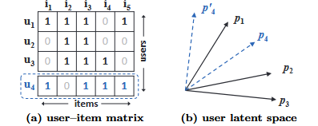

观察图a 的前三行（用户）。很容易有 s23(0.66) > s12(0.5) > s13(0.4)。

```
s表示jaccard系数。给定两个集合A,B，Jaccard 系数定义为A与B交集的大小与A与B并集的大小的比值。
```

因此，潜在空间中 p1、p2 和 p3 的几何关系可以绘制如图  b 所示。现在，让我们考虑一个新用户 u4，其输入如图 a 中的虚线所示。我们可以有 s41(0.6) > s43(0.4) > s42(0.2)，这意味着 u4 与 u1 最相似，其次是 u3，最后是 u2。然而，如果 MF 模型将 p4 最接近 p1（这两个选项如图 1b 中的虚线所示），则会导致 p4 比 p3 更接近 p2，不幸的是，这会导致较大的排名损失。


上面的例子展示了简单的内积来表示低维度空间中复杂user-itme交互带来的局限性，当然一种可能的方法是增加潜在因子的维度，然而，它可能会对模型的泛化产生不利影响。

#### NCF

##### framework

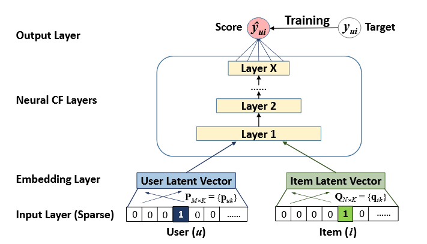

如上，采用多层表示来对用户-项目交互 yui 进行建模，底部输入层由两个特征向量 v^U_u 和 v^I_i 组成，分别描述用户 u 和项目 i；（它们可以被定制以支持广泛的用户和项目建模，如上下文感知，基于内容，基于邻居等）。

本文仅关注于协同过滤，因此仅使用用户和项目的身份作为输入特征，将其转换为具有 one-hot 编码的二值化稀疏向量。通过这种用于输入的通用特征表示，我们的方法可以通过使用内容特征来表示用户和项目来轻松调整以解决冷启动问题。

输入层之上是embedding层；它是一个全连接层，将稀疏表示投影到密集向量。获得的用户（项目）嵌入可以看作是潜在因素模型背景下用户（项目）的潜在向量。

然后将用户嵌入和项目嵌入输入多层神经架构（NCF层），以将潜在向量映射到预测分数。NCF 层的每一层都可以进行定制，以发现用户-项目交互的某些潜在结构。

最后一个隐藏层X的维度决定了模型的能力。最终输出层是预测得分 yˆui，通过最小化 yˆui 与其目标值 yui 之间的逐点损失来进行训练。

```
我们注意到训练模型的另一种方法是执行成对学习，例如使用贝叶斯个性化排名[27]和基于边缘的损失[33]。由于本文的重点是神经网络建模部分，因此我们将 NCF 成对学习的扩展作为未来的工作。
```

上面的结构可以表示为

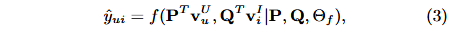

其中PQ表示用户和项目的潜在因子矩阵，theta_f 表示交互函数 f 的模型参数，其神经网络表示方法为

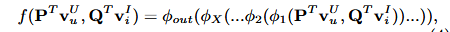

fai_i 是第 i 层的映射函数。

##### loss

loss定义为

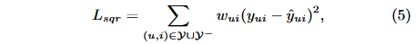

其中 Y 表示集合 **Y** 中观察到的相互作用的数量，Y− 表示负实例的集合，它可以是所有未观察到的相互作用（或从中采样）；wui 是一个超参数，表示训练实例 (u, i) 的权重。

然而均方误差的初衷是假定观测值是按照高斯分布的，这与隐式反馈中yui取0，1两种值是矛盾的，因此本文提出了一种新方法。

正如上文所说，将yui视为一个标签，1代表相关，0反之。预测出的 y^ ui 则表示 i 与 u 有多大概率相关，即使她限制在0~1的范围内，因此 output layer 可以采用概率函数作为激活函数。

因此，定义似然函数

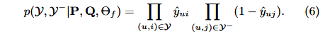

对其取负对数

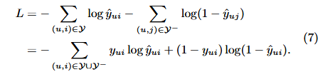

得到了新的损失函数，其实也是二元交叉熵损失。也就是说，我们把隐式反馈当作二元分类问题。

```
在负实例 Y- 的处理上，文中提到均匀采样，即在每次迭代中从未观察的交互中均匀选择负实例，并可以控制采样比例。虽然文中提到的均匀采样方法已经有效，但也指出未来可以探索更复杂的非均匀采样策略，例如基于物品受欢迎程度的策略，这可能会进一步提高模型性能。
```

##### GMF

generalized matrix factorization ，广义矩阵分解

矩阵分解其实是NCF的特例，如果把 embedding layer 的向量看作矩阵分解后的向量，将第一个 NCF 层的映射函数定义为向量的内积

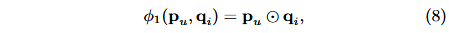

然后将其投影至输出层

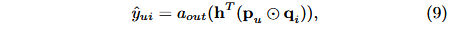

其中aout和h分别表示输出层的激活函数和边权重。直观上，如果我们对 aout 使用恒等函数并强制 h 为 1 的统一向量，我们就可以准确地恢复 MF 模型。

在本次实验中，我们将sigmoid函数作为 aout ，并使用交叉熵误差学习 h 。我们把它称为GMF。

##### MLP

NCF 通过两条路径对user和item建模，因此将二者拼接是很直观的。然而简单的向量串联不能表示user-item的交互，因此在连接向量上添加隐藏层，再通过MLP学习二者的交互

```
这相比于GMF对二者的简单乘积更加灵活
```

具体来说，MLP如下

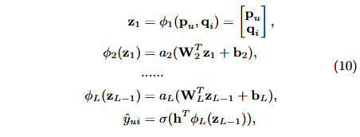

Wx、bx 和 ax 分别表示第 x 层感知器的权重矩阵、偏置向量和激活函数。

此外，很高的曾使用更少的神经元，以学习到数据更多的抽象特征。本文中每层的大小都会递减一半。

##### GMF+MLP


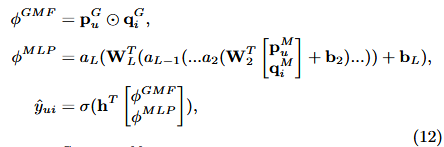

我们让而这单独学习嵌入，并连接最后的隐藏层，如下所示

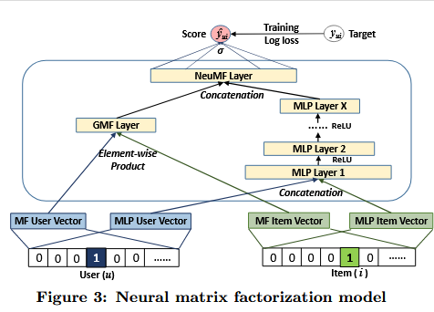

其表示为

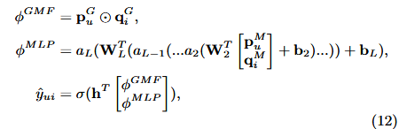

即 NeuMF。

##### preTraining

我们首先使用随机初始化来训练 GMF 和 MLP，直到收敛。然后我们使用它们的模型参数作为 NeuMF 参数相应部分的初始化。

唯一的调整是在输出层，我们将两个模型的 h 按权重拼接

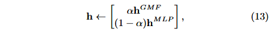

其中hGMF和hMLP分别表示预训练的GMF和MLP模型的h向量； α 是一个超参数，决定两个预训练模型之间的权衡。

其中预训练模型的优化选择了Adam。但是NeuMF选择了SGD，因为我们没有保留动量信息。

##### 实验

选择MovieLens，Printerest作为数据集。其中虽然movielens是显式数据。但是我们将每个ratings转化为0或者1。

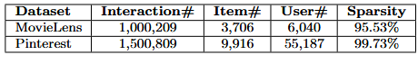

暂略。
