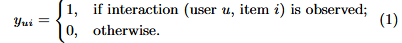

Neural Collaborative Filtering

#### 0

神经协同过滤NCF。来自WWW 2017。[原文](https://arxiv.org/abs/1708.05031)。

基于神经网络的技术在隐式反馈的基础上解决RS中的关键问题——CF。采用MLP来学习user-item交互函数。

之前已有一些工作利用DNN进行推荐任务，但是其主要使用DNN进行建模辅助信息如

（ A. Van den Oord, S. Dieleman, and B. Schrauwen. Deep content-based music recommendation. In NIPS, pages 2643–2651, 2013.

[38] H. Wang, N. Wang, and D.-Y. Yeung. Collaborative deep learning for recommender systems. In KDD, pages 1235–1244, 2015.

[45] F. Zhang, N. J. Yuan, D. Lian, X. Xie, and W.-Y. Ma. Collaborative  knowledge base embedding for recommender systems. In KDD, pages 353–362, 2016.）

，在关键的协同过滤效果时仍采用MF，利用内积结合用户和项目的特征。

#### 一些预备知识

##### 隐式数据

让 M 和 N 分别表示用户和项目的数量。我们根据用户的隐式反馈将用户-项目交互矩阵 Y ∈ RM×N 定义为：



这里 yui 的值为 1 表示用户 u 和项目 i 之间存在交互；然而，这并不意味着你真的喜欢我。同样，值为 0 并不一定意味着 u 不喜欢 i，可能是用户不知道该项目。这给从隐式数据中学习带来了挑战，因为它只提供有关用户偏好的噪声信号。虽然观察到的条目至少反映了用户对项目的兴趣，但未观察到的条目可能只是缺少数据，并且自然缺乏负面反馈。

具有隐式反馈的推荐问题被表述为估计 Y 中未观察到的条目的分数的问题，该分数用于对条目进行排名。

基于模型的方法假设数据可以由底层模型生成（或描述）。形式上，它们可以抽象为学习 yˆui = f (u, i|θ)，其中 yˆui 表示交互的预测得分 yui，θ 表示模型参数，f 表示将模型参数映射到预测得分的函数（我们称之为交互函数）。

为了估计参数 θ，现有方法通常遵循优化目标函数的机器学习范式。文献中最常使用两种类型的目标函数——逐点损失 [14, 19] 和成对损失 [27, 33]。作为大量显式反馈工作的自然延伸[21, 46]，逐点学习方法通常遵循回归框架，通过最小化 yˆui 与其目标值 yui 之间的平方损失。为了处理负面数据的缺失，他们要么将所有未观察到的条目视为负面反馈，要么从未观察到的条目中采样负面实例[14]。对于成对学习 [27, 44]，其想法是观察到的条目应该比未观察到的条目排名更高。因此，成对学习不是最小化 yˆui 和 yui 之间的损失，而是最大化观察到的条目 yˆui 和未观察到的条目 yˆuj 之间的余量。向前迈进了一步，我们的 NCF 框架使用神经网络参数化交互函数 f 来估计 yˆui。因此，它自然支持逐点学习和成对学习。

##### 矩阵分解（MF）

MF 将相互作用 yui 估计为 pu 和 qi 的内积：


其中 K 表示潜在空间的维度。

MF 对用户和项目潜在因素的双向交互进行建模，假设潜在空间的每个维度彼此独立，并以相同的权重将它们线性组合。因此，MF 可以被视为潜在因素的线性模型。

```
给定两个集合A,B，Jaccard 系数定义为A与B交集的大小与A与B并集的大小的比值
```

矩阵的缺陷：

#### NCF

##### framework


