Personalized top-N sequential recommendation via convolutional sequence embedding.

#### 0

caser,CNN+序列推荐，即利用滤波器捕捉item嵌入矩阵的特征。这篇文章很喜欢举例子，令人感动。

```
绪论中有一个形象的比喻，uer 的general behavier 可以是更喜欢苹果产品相比于三星产品，与之相对的 sequential patterns代表了用户短期和动态的行为，比如说他刚买了iphone。基于general behavier 的推荐不会推荐user手机配件，但是关注时序后可以推荐手机配件。
```

序列推荐旨在给定Su （item序列），考虑sequential patterns和 general perferences，为每个user推荐一个item list来最大化满足他的需求，

现有的模型并未考虑顺序模式中的跳跃行为，如c

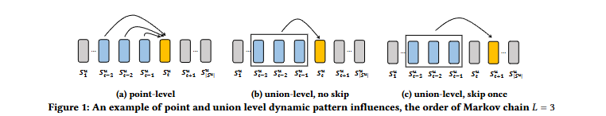

```
例如，一个游客依次在机场、酒店、餐厅、酒吧和景点进行签到。虽然机场和酒店的签到并不紧邻景点的签到，但它们与后者有很强的关联性。另一方面，餐厅或酒吧的签到对景点的签到影响较小（因为它们不一定会发生）。
```

#### 1

为了验证跳跃行为的影响，使用一种规规则来衡量序列强度，

对于序列

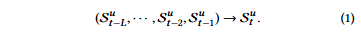

属于规则X→Y，

定义支持度计数sup(XY)，是指在序列中按规则顺序出现X和Y的次数，置信度sup(XY)，是指在出现X的序列中，Y在X之后发生的百分比。通过将右侧改为Sut+1或Sut+2，该规则也可以捕捉到一或两步跳跃的影响。

在 Movielens和Gowalla 进行筛选置信度大于50的规则

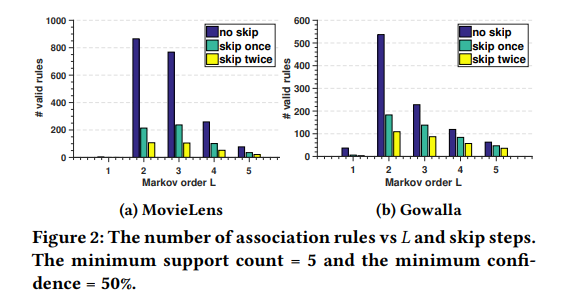

可见考虑跳跃行为是合理的。

#### model

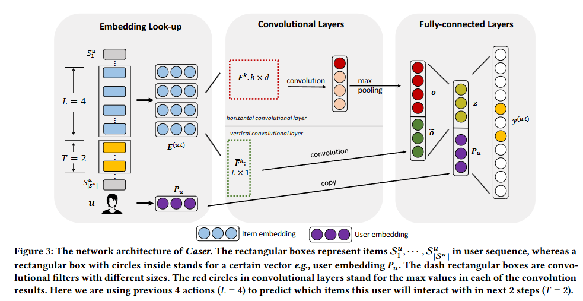

##### embed

从用户的序列 Su 中提取每 L 个连续项目作为输入，以及它们的下 T 个项目作为目标。这是通过在用户的序列上滑动一个大小为 L + T 的窗口完成的，每个窗口生成一个用户 u 的训练实例，表示为一个三元组 (u, 前 L 项目, 下 T 项目)。

项目 i 的嵌入 Qi ∈ R^d 堆叠得到用户 u 在时间步 t 的矩阵 E(u,t) ∈ R^{L×d}：

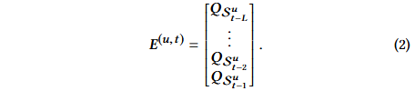

用户 u 嵌入 P_u ∈ R^d，表示用户在潜在空间中的特征。

##### conv

item 嵌入矩阵可以被看作图像，用滤波器提取 sequential patterns这种特征。

```
但是和cv的像素不同，embed矩阵并非初始定值，而是要和滤波器一同训练。
```

打个比方

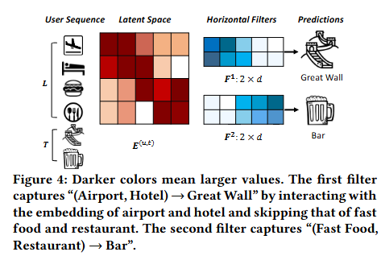

如上，两个“水平滤波器”，它们捕捉两个联合级的顺序模式。这些滤波器表示为 h × d 的矩阵，滤波器的高度为 h = 2，并且宽度等于 d。它们通过在 E 的行上滑动来捕捉顺序模式。例如，第一个滤波器通过在机场和酒店的潜在维度上有较大的值，捕捉顺序模式“(机场, 酒店) → 长城”。

###### 水平卷积

卷积层的上部分是水平卷积。

该层具有 n 个水平滤波器 F_k ∈ R^{h×d}，其中 1 ≤ k ≤ n。 h 的值为 {1, ···, L}

```
例如，如果 L = 4，可以选择 n = 8 个滤波器，每个 h 值（1、2、3、4）都有两个滤波器。通过滑动不同高度的滤波器，可以无论信号的位置如何都能够捕捉到显著信号。因此，水平滤波器可以被训练以捕捉具有不同联合大小的联合级模式。
```

**F_k** 将从 **E** 的顶部向底部滑动，并与 **E** 的所有水平维度交互，交互的结果是第 **i** 个卷积值，即、

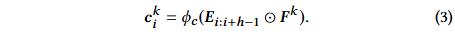

滤波器 **F_k** 的最终卷积结果是向量

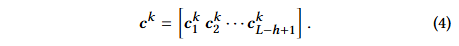

然后，我们对 **c^k** 应用最大池化操作，从该滤波器产生的所有值中提取最大值。最大值表示该滤波器提取的最显著特征。因此，对于该层中的 **n** 个滤波器，输出值 **o ∈ R^n** 为：


###### 垂直卷积

卷积层的下部分是垂直卷积。这层的符号都比水平卷积多个波浪线。

假设有 \tilde{n} 个垂直滤波器 \tilde{F_k} ∈ R^{L×1}，其中 1 ≤ k ≤ \tilde{n}。每个滤波器 \tilde{F_k} 与 E 的列交互，通过从左到右滑动 d 次，得到垂直卷积结果

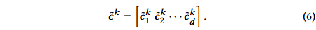

```
其实就是矩阵的行加权求和，权重滤波器对应行的值。相当于聚合了前 L个项目的嵌入。每个滤波器都充当了一个不同的聚合器
```

使用 \tilde{n} 个全局垂直滤波器为所有用户生成 \tilde{n} 个加权求和 \tilde{o} ∈ R^{d * \tilde{n}}：

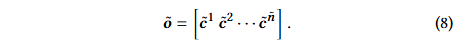

```
每个垂直滤波器的大小固定为 L × 1，因为 E 的每列都是潜在的，同时与多列交互是没有意义的。并且不需要应用最大池化操作，因为我们希望保留每个潜在维度的聚合结果。
```

###### 全连接层

将两个卷积层的输出连接起来，并将它们输入到一个全连接的神经网络层，以获取更高层次的抽象特征：

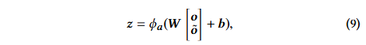

W ∈ R^{d * (n + d \tilde{n})} 是将连接层投影到 d 维隐藏层的权重矩阵，b ∈ R^d 是对应的偏置项，ϕa(⋅) 是全连接层的激活函数。z ∈ R^d 是我们称为的卷积序列嵌入，编码了之前 L 个项目的各种顺序特征。

为了捕捉用户的一般偏好，还查找用户的嵌入 **P_u**，与 **z**  连接在一起，组成 2d 长度的列向量，并将它们投影到具有 **|I|** 个节点的输出层中。

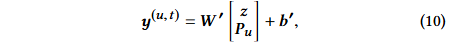

**b' ∈ R^{|I|}** 和 **W' ∈ R^{|I| \times 2d}** 分别是输出层的偏置项和权重矩阵。

```
z 旨在捕捉短期的顺序模式，而用户嵌入 P_u 捕捉用户的长期一般偏好。
```

#### train

使用 sigmoid 将输出转化为概率

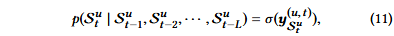

设 Cu = {L + 1， L + 2， ...， |Su |}是我们要对用户 u 进行预测的时间步长的集合。数据集中所有序列的可能性

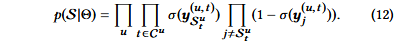

为了进一步捕获跳过行为，我们可以考虑下 T 个目标项 Dtu = {Stu ， Su t +1， ...， Su t+T }，方法是将上述等式中的下一个项 Stu 替换为 Dtu 。

取似然的负对数，我们得到目标函数

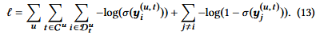

```
上式也称为二进制交叉熵损失
```

模型参数 Θ = {P， Q， F ， F ̃，W ，W ′， b， b′} 是通过最小化训练集上方程 （13） 中的目标函数来学习的，而超参数（例如，d、n、n ̃、L、T ）是通过网格搜索在验证集上进行调整的。

```
采用自适应矩估计 （Adam） 的随机梯度下降 （SGD） 变体，以实现更快的收敛，批处理大小为 100。正则化采用两个方法，L2 范数应用于所有模型参数，并且在全连接层使用丢弃率50%的 Dropout 具有。
```

#### perdict

取 u 的潜在嵌入 Pu 并提取方程 （2） 给出的他最后 L 项的嵌入作为神经网络输入。使用输出层 y 中值最高的 N 个项目。向所有用户提出建议的复杂度为 O（|U||I|d）。

#### 实验

没有直接使用公开数据集，而是对他们进行了顺序关联的规则挖掘，并计算它们的顺序强度。

定义 SI 估计顺序信号的强度

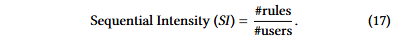

分子是使用support（即 5）和置信度（即 50%）找到的公式（1）形式的规则总数，分母是用户总数。

删除了冷启动项目和反馈小于 n 的项目

训练验证测试 712

指标 p r map

给定用户的前 N 个预测项目列表，表示为 R^1:N ，以及她/他的序列中最后 20% 的操作（即表示为 R（即测试集））

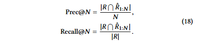

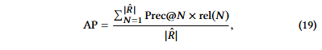

其中，如果 Rˆ 中的第 N 个项目在 R 中，则 rel(N ) = 1。平均精度 (MAP) 是所有用户的 AP 平均值。

result

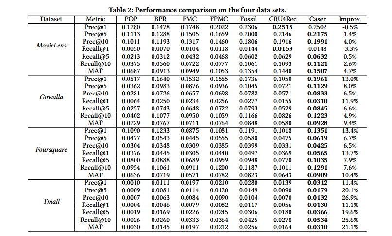

超参数研究

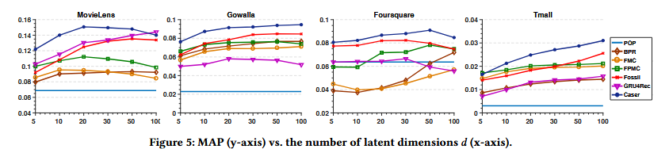

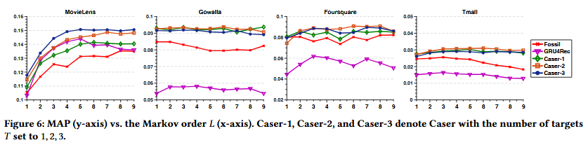

组件分析

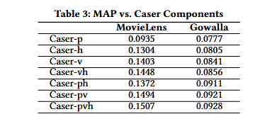

实例分析

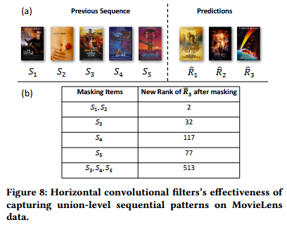

