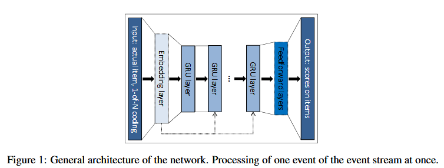
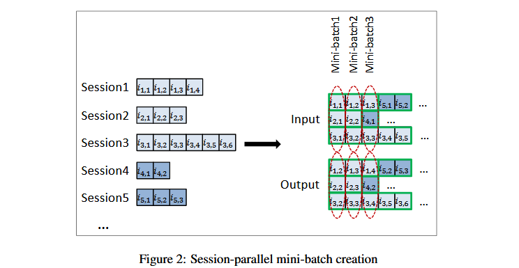
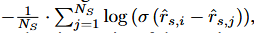
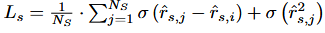

SESSION-BASED RECOMMENDATIONS WITH  RECURRENT NEURAL NETWORKS

#### 0

首篇RNN + RS，即GRU4Rec。

具体来说，将用户进入网站时点击的第一个项目视为 RNN 的初始输入，然后希望根据该初始输入查询模型以获取推荐。用户的每次连续点击都会产生一个输出（推荐），该输出取决于之前的所有点击。

与传统 nlp 任务相比，序列推荐有两个主要区别。一是序列稀疏，二是loss的设计。

#### -1

传统会话推荐方法是基于项目相似度的，即根据已有会话信息计算项目到项目的相似性矩阵——会话中经常一起单击的项目被认为是相似的。使用该相似性矩阵来即可推荐与用户当前点击的项目最相似的项目。但这些方法仅考虑用户的最后一次点击，实际上忽略了过去点击的信息。

以及基于一阶马尔可夫链的方法，其中下一个推荐可以根据项目之间的转移概率简单地计算。然而当尝试包含所有可能的用户选择序列时，状态空间很快就会变得难以管理。

基于GFF的方法通过事件的总和来对会话进行建模。但是，此方法不考虑会话内的任何顺序。

#### model



网络的输入

是会话的实际状态，而输出是会话中下一个事件的项目。会话的状态可以是实际事件的项目，也可以是会话中迄今为止的事件。前者项目用独热编码代替，后者使用独热编码的加权和——越早的项目权重越低。

```
我们还尝试添加额外的嵌入层，但 1-of-N 编码总是表现更好。
```

输出

是项目的预测偏好，即每个项目成为会话中下一个项目的可能性。

batch

不同会话的项目数量会差别很大，并且要捕捉完整会话的信息，不能将其分割。因此传统 nlp 任务中的batch方法需要做出调整。



采样

正采样，常规推荐分数的计算需要对每个步骤和项目对进行建模，这是不可行的，所以只挑选部分的项目，也只更改部分项目的参数。

负采样，如果一个项目受欢迎，那用户没有与之产生交互的原因是没有看见的概率很小。因此不为每个训练示例生成单独的样本，而是使用小批量其他训练示例中的项目作为负示例。这样可以节约很多采样时间，同时，这种方法也是基于流行度的采样，因为一个项目出现在小批量的其他训练示例中的可能性与其流行度成正比。

loss

可以看作是分类问题，但是排名问题更优。排名问题有主逐点排名，成对排名，列表排名。本文中使用第二个。

一是BPR，贝叶斯个性化排名，比较正项和抽样负项的分数并使用它们的平均值作为损失。rˆs，k 是会话给定点上项目 k 的分数，i 是所需项目（会话中的下一项），j 是负样本。



二是 top1 排名，我们希望强制负例的分数在 0 左右，因此添加了一个正则化项目。



#### 实验

略
