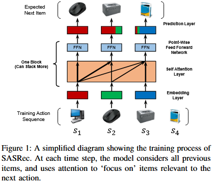
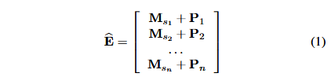
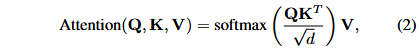
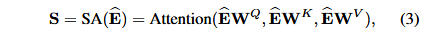
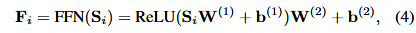
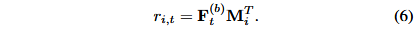

Self-Attentive Sequential Recommendation

transformer + 序列推荐。具体来说，采用自注意力机制来对用户的历史行为信息建模，提取更为有价值的信息。最后将得到的信息分别与所有的物品embedding内容做内积，根据相关性的大小排序、筛选，得到Top-k个推荐。

具体来说，在每个时间步骤，SASRec 都会尝试识别哪些项目与用户的操作历史记录“相关”，并使用它们来预测下一个项目。



#### model

##### embed

创建一个项目嵌入矩阵 M ∈ R|I|×d，其中 d 是潜在维度，并检索输入嵌入矩阵 E ∈ Rn×d，其中 Ei = Msi 。常量零向量 0 用作填充项的嵌入。

###### 位置编码

为了增加位置信息，将一个可学习的位置嵌入 P ∈ Rn×d 注入到输入嵌入中：



```
实验分析了传统绝对位置嵌入，发现其性能会变差
```

##### 注意力

定义



Q 代表查询，K 代表键，V 代表值（每行代表一个项目）。直观上，注意力层计算所有值的加权和，其中查询 i 和值 j 之间的权重与查询 i 和键 j 之间的交互有关。比例因子√d是为了避免内积值过大，特别是当维度较高时

###### 自注意力

操作将嵌入 ̂E 作为输入，通过线性投影将其转换为三个矩阵，并将它们输入注意力层：



其中投影矩阵 WQ, WK , WV ∈ Rd×d。考虑序列的性质，要对Qi，Kj 进行掩码。

##### 前馈网络

引入非线性的因素考虑不同潜在维度之间的相互作用，对所有 Si 同样应用点式两层前馈网络（共享参数）：



其中 W(1)、W(2) 是 d × d 矩阵，b(1)、b(2) 是 d 维向量。

###### 堆叠

在第一个自注意力块之后，Fi 本质上聚合了所有先前项目的嵌入（即 ̂Ej, j ≤ i）。然而，通过另一个基于 F 的自注意力块来学习更复杂的项目转换可能会很有用。具体来说，我们堆叠自注意力块（即自注意力层和前馈网络），以及第 b 个自注意力块。 (b > 1) 块定义为：


第一个块定义为 S(1) = S 和 F(1) = F。

##### 残差 LN Dropout


现有的顺序推荐方法表明，最后访问的项目在预测下一个项目方面发挥着关键作用[1]、[19]、[21]。然而，在几个自注意力块之后，最后访问的项目的嵌入与所有先前的项目纠缠在一起；添加剩余连接以将最后访问的项目的嵌入传播到最后一层将使模型更容易利用低层信息。

层归一化：层归一化用于跨特征（即零均值和单位方差）对输入进行归一化，这有利于稳定和加速神经网络训练[36]。


其中 是逐元素乘积（即哈达玛乘积），μ 和 σ 是 x 的均值和方差，α 和 β 是学习的缩放因子和偏差项。

Dropout：为了缓解深度神经网络中的过度拟合问题，“Dropout”正则化技术已被证明在各种神经网络架构中有效[38]。

##### perdict

在 b 个自注意力块自适应且分层地提取先前消费项目的信息之后，我们根据 F(b) t 预测下一个项目（给定前 t 个项目）。具体来说，我们采用 MF 层来预测项目 i 的相关性：


其中 ri,t 是给定前 t 个项目（即 s1、s2、...、st）的情况下项目 i 作为下一个项目的相关性，N ∈ R|I|×d 是项目嵌入矩阵。因此，高交互分数 ri,t 意味着高相关性，我们可以通过对分数进行排名来生成推荐

##### 共享embed

为了减小模型大小并减轻过度拟合，我们考虑另一种仅使用单个项目嵌入 M 的方案：



