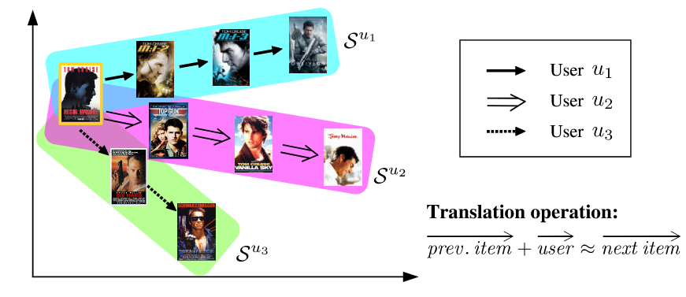
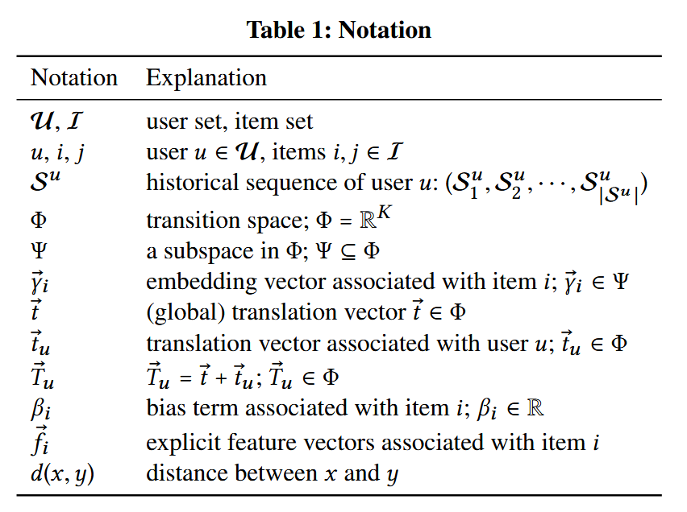
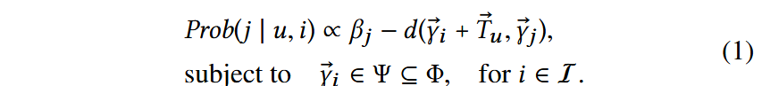
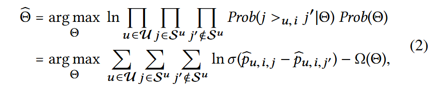
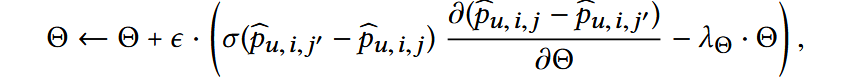

Translation-based recommendation

#### 0

之前序列推荐专注于对用户偏好和项目序列分开建模（MC，FPMC），这其实是不利的——因为三者是相关的。TransRec，对用户，项目序列，和预测项目进行三维建模，从而进行序列推荐，

具体来说，项目作为点嵌入到（潜在的）过度空间 “transiton space”中；每个用户都被表示为同一空间中的“平移向量translation vector”。然后，通过个性化平移操作捕获前面提到的三阶交互：前一项 i 的坐标加上 u 的平移向量（近似）确定下一项 j 的坐标，即 γ®i + t® u ≈ γ®j 。

最后，我们对 (u, i, j) 三元组与距离函数 d(γ®i + t®u , γ®j ) 的兼容性进行建模。

在预测时，可以通过以 γ®i + t®u 为中心的最近邻搜索来进行推荐。



#### model

##### signal

系统中用户集合 (U)， 交互的项目集合 (I)。

对于每个用户 u ∈ U，我们有一个与 u 交互过的项目序列 Su = (Su 1 , Su 2 , ··· , Su |Su |) 。给定所有用户的序列集 S = {Su1 , Su2 , ··· , Su|U| },序列推荐旨在预测每个用户要消费的下一个项目并相应生成推荐列表。



一些符号定义如上。

模型旨在学习 yi 及 tu ，使得


式子使用约等于号，即在某种空间距离度量下，yj 是 左项的最近邻即可，而不用严格相等。

一种常见的解决方法是用内积衡量向量的相似性，但是如果用户倾向于从项目 A 过渡到两个项目 B 和 C，内积无法保证b，c也是相近的。因为内积不能保证 三角不等式（？没太明白其实。内积确实会有这个问题，但是三角不等式怎么能确保呢？）

t 是全局的转换向量，其使得


如此，tu 可以被视为与用户 u 相关联的偏移向量

```
由于生产环境中数据的稀疏性，很难为每个用户学习到一个向量，因此添加了一个全局翻译向量来初始化所有的用户，这样也能够有效的缓解用户冷启动。
```

最后，顺序推荐的概率如下



```
项目向量都属于一个大空间的一个子空间，如单位球，这种技术已被证明有助于缓解“维数灾难”问题
```

使用单个偏差项 βj 以捕获总体项目受欢迎程度，热度越高，偏置越小。

##### train

模型训练的最终目标是将真实项目 j 的排名高于所有其他项目 (j′ ∈ I \ j)。这里采用了顺序贝叶斯个性化排名（S-BPR) ，我们在给定 u ，i 的情况下优化排序。（> ui定义为此种情况下的排序大于号）

其中 i 是 Su 中 j 的前一项，p_u,i, j 是 eq（1）中预测的简写。 θ 是参数的集合——{βi ∈I, γ_i ∈I, t_u ∈U, t}，Ω(θ) 是L2 正则化器。请注意，根据 S-BPR，真实项 j 的排名高于“负”项 j′（即 Prob(j >u,i j′|θ)）的概率由 sigmoid 函数 σ 估计(p_u,i,j − p_u,i,j′)。

项目嵌入 γ_i ∈I 和 t 被随机初始化为单位向量。 βi ∈I 和 t_u ∈U 被初始化为零。首先，我们从 U 中均匀采样用户 u。然后，从 Su 中均匀采样“正”项 j 和“负”项 j′ ，j 是Su中的非头项目，j‘ 是 I 中的非 Su 项目。

对于 eq2 ，我们使用 SGA 随机梯度上升进行训练



最后，我们将 γ_i 、 γ_j 和 γ_j′ 重新归一化为 Ψ 中的向量。

```
例如，如果我们让 Ψ 为单位 L2-ball，则 γ ← γ/max(1, ∥γ∥)。  重复上述步骤直到收敛或直到验证集上的准确率达到稳定水平。这就是上文所说的“单位球”
```

##### test

对于结果  βj ，将 βj 替换为 βj′ = βj − maxk ∈I βk（对于 j ∈ I）。（移动偏差项不会改变任何查询的项目排名。）

接下来，将 βj′ 吸收到 γ_j 中，对于 L2 距离（平方）得到 γ_j′ = (γ_j ; sqrt(−βj′) )，或者对于 L1 距离 γ_j′ = (γ__j ; β_j′)距离。

最后，给定用户 u 和项目 i，获得“查询”坐标 (γ_i + T_u ; 0)，然后可将其用于检索 γ_j′ 空间中的最近邻居。

#### experiment

暂略

#### Item-to-item recommendation

在TransRec中，通过删除个性化向量部分，TransRec可以直接进行物品到物品的推荐。同样也进行了实验，不再赘述。

