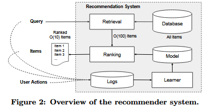
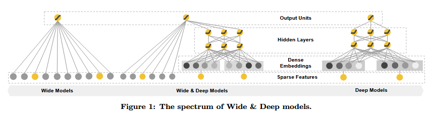
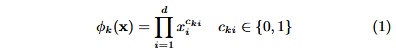
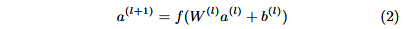
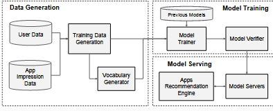
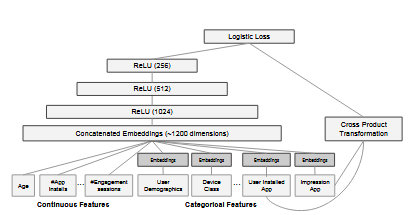

Wide \& deep learning for recommender systems

读的有点迷。企业里的论文都比较简单，而且感觉思维方式与之前那篇NCF很相近。

#### 0

本文提出了 W&D 的 RS 框架，以结合 RS 的记忆 Memorization 和泛化generalization 的优点

Memorization 指的是学习项目或特征的频繁共现并利用历史数据中可用的相关性， generalization 基于相关性的传递性，并探索过去从未或很少出现过的新特征组合。

逻辑回归 LR，等诸多线性模型别广泛地用于 RS，其使用稀疏的 onehot 编码对二值化特征进行训练，其可以有效实现 Memorization。但这往往需要手动特征工程，并且不能推广到训练数据未出现的item的特征。

embedding model 可以为每个查询和item学习低维得得密集特征向量，从而泛化到未见过的查询和item，然而低维向量会因其高度概括导致本无交互向量的非零预测，从而推荐不相关的建议。

因此，本文结合了线性模型wide+神经网络deep，通过联合训练二者在一个模型中实现记忆和泛化。

#### RS 综述

本文来自google play，因此更侧重于介绍app RS的情况，其该概要如下。

#### W & D

##### wide

三部分最左端是 wide 部分，是形如 y = wT x + b 的广义线性回归模型，x 是d 维特征向量，w 是参数向量，b是偏差。

特征包括原始的输入特征和交叉特征，交叉特征定义为

对于第 k 个交叉，cki = 1 当且仅当 xi 特征是第 k 个交叉所关注的，反之则为 0 ，（？没明白怎么实现的）

##### deep

deep 部分是简单的前馈神经网络，如上图最右侧所示，稀疏的高维特征向量被转化为低维密集向量，随后这些向量被传入神经网络的隐藏层中，每个隐藏层执行如下的计算

其中 l 是层数，f 是激活函数， a(l)、b(l) 和 W(l) 是第 l 层的激活、偏差和模型权重。

##### joint training

二者通过 joint 的方法拼接，分开训练相同的参数。

#### 系统实现

app 推荐的 pipeline 如上，包括三个阶段

##### 数据生成

##### 模型训练

##### 模型服务

#### 实验

