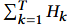
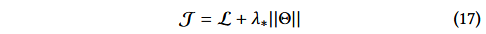

xDeepFM: Combining explicit and implicit feature interactions for recommender systems.

压缩交互网络CIN + DNN，仍然是显式学习有度交互+隐式低高纬特征交互。

[源码](https:// github.com/ Leavingseason/ xDeepFM)。

#### 0

在此可以回忆一下之前的几篇论文，

W&D的deep部分在embed之后使用DNN学习高阶特征交互，但是其按位建模，同一feature的embed中的不同元素也互相影响。

DeepFM在DNN之外添加了双向交互层，（FM）其可以按向量进行交互。但是局限于2阶交互。

DCN 使用crossNet学习一种特殊类型的高阶交互。然而其每层的输出都是x0的标量倍数，这会受到一定限制，同时其交互也是按位进行的。

```
标量倍数并不等同于线性相关，系数是对x0敏感的。这可以通过数学归纳法证明。
```

因此本文的CIN，致力于1. 按向量的交互计算特征，2. 显示计算高阶交互 3. 较低复杂度

#### model

##### Compressed Interaction Network

不同于之前的模型，我们将不同特征的embed组成矩阵X0 ∈ Rm×D ，其中 X0 中的第 i 行是第 i 个字段的嵌入向量。CIN 中第 k 层的输出也是一个矩阵 Xk ∈ RHk ×D ，其中 Hk 表示第 k 层中（嵌入）特征向量的数量。Xk计算公式如下


其中 1 ≤ h ≤ Hk , Wk,h ∈ RHk−1×m 为第 h 个特征向量的参数矩阵， ◦ 表示逐项乘积。Hk 矩阵的每一行，即第 h 个feature embed，是由 Hk-1的第 i 行 和 H0 的第 j 行逐项乘积再乘以系数（对应参数矩阵的值）求和得到。

```
第 k 层将Hk-1 * m个向量加权求和为一个新行向量，即Compressed。
```

如此设计，交互是按向量计算的，这是很显然的。

更深一步，CIN与CNN其实有某种共性


如图4a所示，我们引入了一个中间张量Zk+1，它是隐藏层Xk和原始特征矩阵X0的外积（沿着每个嵌入维度）。那么Zk+1可以看作是一种特殊类型的图像（？），Wk,h是一个滤波器。我们沿着嵌入维度（D）将滤波器滑动到 Zk+1 上，如图 4b 所示，得到一个隐藏向量 Xk +1 i,* ，在计算机视觉中通常称为特征图。  因此，Xk是Hk个不同特征图的集合。 CIN 名称中的“压缩”一词表示第 k 个隐藏层将 Hk−1 × m 向量的潜在空间压缩为 Hk 向量。

CIN的架构如下所示


让 T 表示网络的深度。每个隐藏层 Xk , k ∈ [1,T ] 都与输出单元有连接。我们首先对隐藏层的每个特征图应用总和池化：


对于 i ∈ [1, Hk ]。因此，我们为第 k 个隐藏层提供了长度为 Hk 的池化向量 pk = [pk 1 ,pk 2 , ..., pkHk ]。来自隐藏层的所有池化向量在连接到输出单元之前被连接： p+ = [p1, p2, ..., pT ]  。如果我们直接使用CIN进行二分类，输出单元是p+上的sigmoid节点：


w0 是回归参数。

（顶上这堆有关CNN特征图和池化没太看懂，暂时把翻译搬过来了）

##### 复杂度分析

第 k 层Hk × Hk−1 × m 个参数，回归层有个参数，因此T层CIN的参数总数为，这是与嵌入向量 D 无关的。与之对应的T层DNN有个参数。

对于Wkh矩阵，可以对其进行分解并将 Wk,h 替换为两个较小的矩阵 Uk,h ∈ RHk−1×L 和 Vk,h ∈ Rm×L：


空间复杂度 from O(mT H^2) to O(mT HL + T H^2 L).

时间复杂度 O(mT H^2)

##### 多项式检查

第一层的第 h 个特征图表示为 x1 h ∈ RD ，计算公式如下：


```
这里为了便于计算，隐藏层的行数都等于m
```

第二层


归纳，第k层


设 V Pk (X) 表示 k 次多向量多项式，a 采用了和DCN中相同的定义：


（？）没看懂 是啥东西。

#### xDeepFM


CIN+DNN。输出为


 是原始特征。 xdknn、p+ 分别是普通 DNN 和 CIN 的输出。 w* 和 b 是可学习的参数。对于二元分类，损失函数是对数损失


添加正则构成优化函数



不难看出，DeepFM，FM都是xDeepFM的特殊情况。

#### 实验

暂略
